# Этап 2. Детальная модель данных, PostgreSQL, API, права и технические сценарии

**Продукт:** десктопный органайзер для одной компании  
**Статус:** нормативная техническая спецификация перед реализацией  
**Архитектурная база:** Этап 1, версия 1.0  
**Целевая БД:** PostgreSQL 16+  
**API:** REST `/api/v1`, OpenAPI 3.1.0  
**Идентификаторы:** UUIDv7, генерируются приложением  
**Конкурентность:** optimistic locking через ETag/If-Match  
**Синхронизация:** bootstrap + change feed + WebSocket invalidation  

> Нормативный приоритет: концепция определяет бизнес-функции; Этап 1 определяет архитектуру; данный пакет конкретизирует реализацию. При расхождении действует явно зафиксированное решение раздела 1.

# 1. Проверка входных документов

## 1.1. Изученные документы

1. Концепция продукта: единственный источник бизнес-функций и пользовательских ожиданий.
2. Архитектура Этапа 1: источник неизменяемых системных границ, топологии, модулей, безопасности и эксплуатации.
3. Техническое задание Этапа 2: требования к полноте и форме текущей спецификации.

Документы прочитаны целиком. Проектирование таблиц выполнялось только после фиксации расхождений, пробелов и неизменяемых решений.

## 1.2. Противоречия и разрешение

| ID | Источник противоречия | Решение | Последствие |
| --- | --- | --- | --- |
| C-01 | Концепция, §18.1: «последняя подтверждённая версия» допускает трактовку last-write-wins; Этап 1, §§0.4.3, 8.10 запрещает молчаливое перезаписывание. | Приоритет Этапа 1. Любая команда с устаревшей версией отклоняется `409 VERSION_CONFLICT`; оба намерения фиксируются только как audit/conflict attempt, но устаревшее изменение не становится состоянием объекта. | Исключает потерю данных. |
| C-02 | Концепция, §19 допускает блокировку или локальную очередь; затем допускает read-only. Этап 1, §§0.1, 8.11 фиксирует online-only запись. | В MVP при потере сервера разрешён только просмотр шифрованного кэша и открытие доступных файлов. Локальной очереди бизнес-команд нет. | Упрощает согласованность; офлайн-редактирование отложено. |
| C-03 | Концепция перечисляет `Пользователь` и `Сотрудник` без границы. Этап 1, §0.4.1 разделяет account/profile. | `iam.user_accounts` хранит вход и состояние безопасности; `org.employee_profiles` хранит кадрово-рабочий профиль. Связь 0..1 account к 1 profile. | Профиль можно завести до активации учётной записи. |
| C-04 | Концепция упоминает рабочее пространство, но система однокомпанейская и Этап 1 не выделяет workspace-модуль. | Отдельной сущности Workspace в MVP нет. Область организации задаётся `organization_id`; проект является рабочим контекстом. | Не вводится пустая абстракция. |
| C-05 | Концепция перечисляет просрочку среди статусов, но Этап 1, §11.1 считает её вычисляемым состоянием. | `overdue` не хранится в `status`; вычисляется по due_at и терминальному статусу. Фоновый процесс создаёт событие/уведомление один раз. | Нет рассинхронизации статуса и времени. |
| C-06 | Концепция допускает один уровень подзадач; перечень сущностей выделяет подзадачу. | Подзадача хранится в `work.tasks` через `parent_task_id`; CHECK/сервисный инвариант ограничивает глубину одним уровнем. | Единые статусы, права, поиск и аудит. |
| C-07 | Файлы не хранятся в БД, но фотография профиля является бинарными данными. | Рабочие файлы не загружаются. Аватар — ограниченное системное вложение `core.system_assets`, отдельный контур, лимит 2 MiB, whitelist MIME, антивирусная проверка. | Сохраняет правило metadata-only для рабочих файлов. |
| C-08 | История должна показывать оба действия, но доступ к объекту может быть отозван. | История фильтруется текущими правами. Только `Audit.ReadAll` видит общий аудит; отзыв прав инвалидирует локальный кэш. | Не допускает утечку через историю. |

## 1.3. Пробелы и допущения

| ID | Пробел | Принятое допущение |
| --- | --- | --- |
| G-01 | Точная версия PostgreSQL/ОС/рантайма | PostgreSQL 16+; .NET LTS, поддерживаемый на дату релиза; версии фиксируются lock-файлами и deployment manifest. |
| G-02 | Тип идентификаторов | UUIDv7 для публичных/домен­ных объектов, bigint identity только для внутренних последовательностей/высокочастотных журналов. |
| G-03 | Правила времени повторений | UTC-инстанты + IANA timezone + локальные recurrence-компоненты; политика DST: gap → первый валидный момент, overlap → ранний offset, если не сохранён explicit offset. |
| G-04 | Retention корзины | 30 дней по умолчанию, настраивается 7–365; legal hold запрещает purge. |
| G-05 | Retention audit/history/change feed | Audit 7 лет по умолчанию; object history 3 года; change feed 90 дней или до подтверждённой compaction watermark; outbox после доставки 30 дней. |
| G-06 | Максимальные размеры | JSON body 1 MiB; комментарий 20k символов; описание 100k; batch 100; page 100 default/500 max; аватар 2 MiB. |
| G-07 | Точное поведение конфликтов | ETag/If-Match обязателен для изменяемых versioned resources; 409 выбран в соответствии с Этапом 1. |
| G-08 | Модель запретов | Explicit deny сильнее allow; затем object/project relation; затем scoped role; default deny. |
| G-09 | Горизонт recurrence | Генерация 90 дней вперёд и не менее 20 экземпляров; расширение ежедневно и при чтении за пределами горизонта. |
| G-10 | Поиск с опечатками | PostgreSQL FTS + pg_trgm, без Elasticsearch; trigram включается для строк от 3 символов. |

## 1.4. Решения Этапа 1, не изменяемые в Этапе 2

| ID | Неизменяемое решение Этапа 1 |
| --- | --- |
| A1-01 | Клиент-серверная архитектура; сервер — единственный источник истины. |
| A1-02 | Backend — модульный монолит ASP.NET Core; PostgreSQL; WPF desktop. |
| A1-03 | Общие записи запрещены без сервера; локальный кэш disposable/read-only. |
| A1-04 | REST/HTTPS для команд и запросов; WebSocket/SignalR-подобный канал для realtime invalidation. |
| A1-05 | Рабочие бинарные файлы не хранятся и не проксируются приложением. |
| A1-06 | OS/SMB ACL остаются авторитетными для физического открытия файла. |
| A1-07 | Optimistic locking; никаких слепых last-write-wins. |
| A1-08 | Audit append-only; outbox + change feed фиксируются в транзакции с изменением. |
| A1-09 | Гибрид RBAC/ReBAC/ABAC, deny by default. |
| A1-10 | Soft delete/корзина перед физическим удалением; физический файл не удаляется. |
| A1-11 | Каждая общая сущность имеет organization boundary. |
| A1-12 | Масштаб MVP: до 300 активных сотрудников, 100 одновременных соединений, ~2 млн задач/событий. |

# 2. Глоссарий и соглашения

## 2.1. Термины

| Термин | Техническое имя | Нормативное значение |
| --- | --- | --- |
| Организация | `Organization` | Единственная tenant-граница. Все общие строки имеют `organization_id`. |
| Пользователь | `UserAccount` | Учётная запись, пароль, статус безопасности и сессии. |
| Сотрудник | `EmployeeProfile` | Рабочий профиль человека; может существовать до активации account. |
| Объект | `core.objects` | Реестр общих объектных ID, lifecycle, версии и audit actor fields. |
| Архив | `archived` | Объект сохранён и read-only по умолчанию, исключён из активных списков. |
| Корзина | `trashed` | Логически удалён, доступен только через Trash и может быть восстановлен. |
| Purge | `purged` | Необратимое физическое удаление метаданных после retention и проверок. |
| Серия | `RecurrenceSeries` | Правило повторения и шаблон; экземпляры являются обычными Task. |
| Экземпляр | `RecurrenceOccurrence` | Уникальная запланированная позиция серии; материализуется в Task. |
| Элемент каталога | `CatalogItem` | Логический элемент дерева; бинарные байты рабочего файла не хранит. |
| Location | `FileLocation` | Один физический URI/path для CatalogItem, ограниченный device/resource. |
| Change feed | `sync.change_feed` | Последовательность авторизационно фильтруемых invalidation-записей. |
| Domain event | `governance.domain_events` | Факт доменного изменения после успешной транзакции. |
| Outbox | `governance.outbox_messages` | Надёжная доставка integration/realtime событий после commit. |

## 2.2. Именование и форматы

- PostgreSQL: `snake_case`, таблицы во множественном числе, схемы по модулям (`iam`, `work`, `projects`, `files`, `crm`).
- API: `/api/v1`, существительные во множественном числе, path `kebab-case`, JSON `camelCase`.
- ID: RFC 9562 UUIDv7, canonical lower-case string, создаётся клиентом или сервером; сервер валидирует timestamp bits и уникальность.
- Время события: ISO 8601/RFC 3339 UTC (`2026-07-24T14:30:00.123Z`); БД `timestamptz`.
- Локальная дата: `date`; локальное время без даты: `time`; timezone: IANA ID (`Europe/Amsterdam`), не Windows display name.
- Enum: `varchar` + CHECK для стабильных локальных enum; справочная таблица для администраторно расширяемых значений.
- Nullable: только когда отсутствие семантически отличается от пустого значения. Пустые строки нормализуются в `NULL`, кроме пользовательского текста, где пустота запрещена CHECK.
- Soft delete: общие объекты через `core.objects.lifecycle_state`; таблицы-детали не имеют самостоятельного `deleted_at`.
- Audit: append-only; секреты, password hashes, refresh tokens, raw credentials и полный UNC с чувствительными сегментами не записываются.
- Версия: `bigint version`, начинается с 1 и увеличивается ровно один раз на успешную команду агрегата.
- Ошибка: RFC 9457 Problem Details с `code`, `traceId`, `correlationId`, `fieldErrors`, `currentVersion`.

# 3. Полный каталог доменных сущностей

| RU | Technical name | Назначение | Владелец/граница | Обязательные | Необязательные | Связи | Инварианты и lifecycle | History/lock | Чувствительность/объём |
| --- | --- | --- | --- | --- | --- | --- | --- | --- | --- |
| Организация | Organization | Единый tenant и корень настроек | Система; один активный tenant | name, status, timezone | legal_name, locale | Departments, users, every domain object | Создаётся bootstrap; не удаляется обычным API; status active/suspended | Audit yes; lock yes | Internal; 1 |
| Учётная запись | UserAccount | Аутентификация и состояние доступа | Identity module | login, password_hash, status, employee_profile_id | last_login_at, lock_until | EmployeeProfile, sessions, roles | login unique среди не удалённых; blocked disables sessions | Audit yes; lock yes | Highly sensitive; ≤500 |
| Профиль сотрудника | EmployeeProfile | ФИО и рабочие данные | Organization directory | first_name,last_name,department_id | position,email,phone,avatar | UserAccount, Department | Может существовать до account; архивируется при увольнении | History yes; lock yes | PII; ≤500 |
| Отдел | Department | Оргструктура и scope прав | Organization directory | name,status | parent_id,manager relations | Employees, managers | No cycles; cannot archive with active children unless reassigned | History yes; lock yes | Internal; ≤100 |
| Устройство | Device | Привязка сессии и device-scoped paths | Identity; user/device fingerprint | name,platform,device_key,status | last_seen_at,app_version | Sessions, file locations, sync state | Device key unique per org; revoked blocks refresh | Audit yes; lock yes | Sensitive metadata; ≤2k |
| Сессия | Session | Серверное состояние входа | Identity | user_id,device_id,status,expires_at | last_seen_at,ip_hash | RefreshToken | Only active session accepts access token; revocation immediate | Audit login; lock no | Highly sensitive; ≤20k/year |
| Refresh token | RefreshToken | Ротация долгой сессии | Identity | session_id,token_hash,expires_at | replaced_by,revoked_at | Session | One-time rotation; reuse revokes token family | Security audit; no optimistic lock | Secret hash; ≤100k/year |
| Роль | Role | Набор разрешений в scope | Authorization | code,name,scope_type,is_system | description | Permissions, user_roles | System roles immutable except display name; unique code/org | Audit yes; lock yes | Internal; ≤100 |
| Разрешение | Permission | Атомарное действие | Authorization catalog | code,resource,action | description | Roles, project roles | Stable immutable code | Seed audit only; no lock | Public metadata; ≤300 |
| Членство роли | UserRole | Назначение роли пользователю | Authorization | user_id,role_id,scope | expires_at | UserAccount, Department/Organization | Unique active assignment; expiry checked on every decision | Audit yes; no lock | Sensitive authorization; ≤10k |
| Явное правило доступа | ExplicitAccessRule | Object-specific allow/deny | Authorization | subject,object,permission,effect | expires_at,reason | core.objects | deny wins; unique active rule | Audit yes; lock yes | Sensitive; ≤100k |
| Проект | Project | Корень проектного агрегата | Project owner/manager | name,status,owner_id,manager_id | description,start_date,target_end_date | Members,tasks,files,contacts | Owner active; status transition controlled; unique name among active configurable | History yes; lock yes | Internal; ≤50k |
| Участник проекта | ProjectMember | ReBAC-отношение пользователя и проекта | Project aggregate | project_id,user_id,project_role_id | joined_at,permission overrides | Project, User | Unique active member; owner cannot be removed before transfer | Audit/history yes; lock yes | Authorization data; ≤1m |
| Проектная роль | ProjectRole | Права внутри проекта | Authorization | code,name | description | ProjectMember, permissions | Fixed seed roles owner/manager/editor/executor/observer | Seed audit; lock yes | Internal; ≤20 |
| Входящий элемент | InboxItem | Быстрое сохранение до классификации | Creator | type,title,created_by | body,url,file draft | Task/CatalogItem conversion | Owned by creator until shared; converted once or trashed | History yes; lock yes | May contain PII; ≤2m |
| Задача/подзадача | Task | Исполнимая единица работы | Project or creator; server authoritative | title,status,priority,author,creator | description,project,parent,date/start/due/duration,contact | Assignees,watchers,checklists,reminders,files,comments | Depth ≤1; terminal status has completed/cancelled timestamp; overdue derived | History yes; lock yes | Internal; ≤2m active/history |
| Исполнитель задачи | TaskAssignee | M:N assignment | Task aggregate | task_id,user_id,assignment_role | assigned_by | Task, User | Unique active pair; at least one primary optionally | Audit/history yes; lock via Task | Internal; ≤5m |
| Наблюдатель | TaskWatcher | Получатель visibility/notifications | Task aggregate | task_id,user_id | notification override | Task, User | Unique active pair; no edit permission by itself | Audit yes; lock via Task | Internal; ≤5m |
| Зависимость задач | TaskDependency | Finish/start dependency | Task aggregate | predecessor_id,successor_id,type | lag_minutes | Tasks | No self-edge or cycle; same organization | History yes; lock yes | Internal; ≤5m |
| Чек-лист | Checklist | Группа простых пунктов | Task aggregate | task_id,title,position | — | ChecklistItem | Position unique per task after normalization | History yes; lock via Task | Internal; ≤3m |
| Пункт чек-листа | ChecklistItem | Малое действие без самостоятельных прав | Task aggregate | checklist_id,text,position,is_completed | completed_by,completed_at | Checklist | completed fields consistent; stable order key | History yes; lock via Task | Internal; ≤30m |
| Серия повторений | RecurrenceSeries | Правило генерации задач | Task module | rrule/rule fields,timezone,status,template | until,count,generation_cursor | Occurrences, exceptions, tasks | Timezone required; exactly one termination mode; deterministic occurrence key | History yes; lock yes | Internal; ≤500k |
| Экземпляр повторения | RecurrenceOccurrence | Материализованный occurrence key | Recurrence module | series_id,occurrence_key,scheduled_local,scheduled_at,status | task_id,skip_reason | Series, Task | Unique(series,occurrence_key); exactly-once insert | Audit yes; lock no | Internal; ≤20m |
| Исключение повторения | RecurrenceException | Изменение/пропуск одного occurrence | Recurrence module | series_id,occurrence_key,type | patch_json | Series | Unique occurrence; patch whitelist | History yes; lock yes | Internal; ≤5m |
| Календарное событие | CalendarEvent | Встреча/событие без task workflow | Calendar module | title,start_at,end_at,timezone | description,location,project | Attendees, reminders, files | end>start; all-day uses local dates; overlap allowed | History yes; lock yes | Internal; ≤2m |
| Участник события | EventAttendee | Связь event-user/contact | Calendar aggregate | event_id,subject,status | response_at | Event, User/Contact | One attendee per subject; response transition controlled | History yes; lock via Event | PII; ≤10m |
| Напоминание | Reminder | Правило времени уведомления | Owner object | target_object,recipient,trigger_type | offset,absolute_at,snooze policy | Task/Event, occurrences | Exactly one trigger mode; only authorized recipient | History yes; lock yes | Internal; ≤5m |
| Срабатывание напоминания | ReminderOccurrence | Идемпотентный запуск | Notification worker | reminder_id,due_at,dedupe_key,status | attempts,last_error | Notification | Unique dedupe key; terminal delivered/cancelled/expired | Audit yes; worker locking | Internal; ≤50m |
| Уведомление | Notification | Inbox-сообщение пользователю | Notification module | recipient,type,title,created_at,status | body,object link,read_at | Deliveries | Immutable content after creation; read/dismiss transitions only | Audit status; lock yes | May contain PII; ≤50m |
| Доставка уведомления | NotificationDelivery | Канал/устройство доставки | Notification module | notification_id,channel,status | device_id,attempt,error | Notification, Device | Unique notification/channel/device attempt key | Technical history; no user edit | Sensitive metadata; ≤100m |
| Элемент каталога | CatalogItem | Логический файл/папка/URL/заметка | File Catalog | type,name,parent_id | description,url,note,mime,size | Locations,tags,object links | Virtual tree acyclic; type-specific fields; no file bytes | History yes; lock yes | Internal; ≤5m |
| Путь к файлу | FileLocation | Физическое расположение логического item | File Catalog | catalog_item_id,location_type,normalized_path,priority | device_id,network_resource_id,is_primary | Device/NetworkResource | Scope-specific uniqueness; type/scope consistency; no credentials | History/audit yes; lock yes | Sensitive path; ≤20m |
| Сетевой ресурс | NetworkResource | Разрешённый SMB/NAS root | Admin/File module | name,unc_root,status | description,probe settings | FileLocations | UNC canonical, allowlisted; credentials never stored in path | Audit/history yes; lock yes | Sensitive infrastructure; ≤500 |
| Проверка location | FileLocationCheck | Последний probe и диагноз | Desktop/server telemetry | location_id,device_id,checked_at,result | latency,error_code | Location | Append/last-state; no raw OS credentials or full stack | Technical history; no lock | Sensitive metadata; ≤100m |
| Компания-контрагент | Company | Юридическое/деловое лицо | CRM | name,status | industry,website,notes | Contacts,channels,addresses,projects,tasks | Name not globally unique; archive not delete if linked | History yes; lock yes | PII/business confidential; ≤1m |
| Контакт | Contact | Физическое лицо вне штата | CRM | first_name,last_name,status | position,notes | Companies,channels,addresses,interactions | May exist without company; merge via explicit operation | History yes; lock yes | PII; ≤5m |
| Роль контакта в компании | ContactCompanyRole | M:N employment/relationship | CRM | contact_id,company_id | title,is_primary,dates | Contact,Company | One active primary role per contact optional | History yes; lock yes | PII; ≤10m |
| Средство связи | CommunicationChannel | Телефон/email/messenger/site | CRM | owner_object,type,value_normalized | label,is_primary,visibility | Contact or Company | Type-specific validation; normalized uniqueness scoped to owner | History yes; lock yes | PII; ≤20m |
| Адрес | Address | Структурированный адрес | CRM | owner_object,country,locality | postal,street,building,raw | Contact/Company | At least raw or structured minimum; no geocoding in MVP | History yes; lock yes | PII; ≤10m |
| Взаимодействие | Interaction | Ручная CRM-хронология | CRM | type,occurred_at,author,summary | next_step,next_step_at,company | Participants, links | Occurred_at may be past; append correction via version/history | History yes; lock yes | Confidential; ≤10m |
| Комментарий | Comment | Пользовательское обсуждение объекта | Collaboration | object_id,author,body | edited_at,reply_to | Any commentable object | No hard edit history loss; delete = tombstone; max depth 1 | Version history; lock yes | May contain PII; ≤50m |
| Версия комментария | CommentVersion | Предыдущий текст комментария | Collaboration | comment_id,version,body,changed_at | change_reason | Comment | Append-only, unique comment/version | Append-only; no lock | May contain PII; ≤100m |
| Тег | Tag | Организационный справочник | Collaboration | name,normalized_name | color,description | ObjectTags | Unique normalized name among active | History yes; lock yes | Internal; ≤100k |
| Связь тега | ObjectTag | M:N tag-object | Collaboration | tag_id,object_id | created_by | Tag, core.object | Unique active pair | Audit yes; no lock | Internal; ≤50m |
| Связь объектов | ObjectLink | Типизированная связь любых объектов | Collaboration | source,target,link_type | metadata constrained | core.objects | No self-link for disallowed types; unique semantic edge | History/audit; lock yes | Potentially sensitive; ≤50m |
| Технический аудит | AuditEntry | Неизменяемый security/operation журнал | Governance | actor,action,object,occurred_at,outcome | before/after redacted,trace,ip hash | All modules | Append-only; partitioned; no secrets | Append-only | Sensitive; high volume |
| История объекта | ObjectHistory | Пользовательская история изменений | Governance | object_id,version,event_type,changed_at | diff_json,snapshot subset | core.objects | Append-only; one row per object version | Append-only | Sensitive; high volume |
| Доменное событие | DomainEvent | Факт домена после commit | Governance | event_id,type,aggregate,payload,occurred_at | schema_version | Outbox/consumers | Immutable, versioned payload, idempotent consumers | Append-only | Internal; high volume |
| Outbox message | OutboxMessage | Надёжная публикация post-commit | Governance | event_id,payload,status,available_at | attempts,error | Workers | Inserted in business transaction; SKIP LOCKED claim | Worker state | Internal; high volume |
| Change feed item | ChangeFeed | Инкрементальная синхронизация | Sync | sequence,object,operation,version,occurred_at | scope_version | Clients | Monotonic sequence; minimal payload; filtered at read | Append-only/compacted | Sensitive metadata; very high |
| Состояние sync-клиента | ClientSyncState | Cursor устройства/пользователя | Sync | user_id,device_id,last_sequence | last_full_sync_at | Device | One row per pair; cursor only advances after local transaction | Audit no; lock yes | Sensitive metadata; ≤2k |
| Корзина | TrashEntry | Retention и восстановление soft-deleted объекта | Governance | object_id,deleted_by,deleted_at,purge_after | reason,legal_hold | core.objects | One active entry/object; restore validates parent/uniqueness | Audit yes; lock yes | Internal; ≤5m |
| Архив | ArchiveEntry | Скрытие завершённых/неактуальных объектов | Governance | object_id,archived_by,archived_at | reason | core.objects | One active entry/object; archived object read-only by default | Audit yes; lock yes | Internal; ≤5m |
| Поисковый документ | SearchDocument | Авторизационно-фильтруемая поисковая проекция | Search | object_id,type,title,search_vector | body,tags,scope keys | core.objects | No secret fields; updated transaction/outbox; tombstone on delete | Derived; no optimistic lock | Derived sensitive; ≤20m |
| Фоновая задача | BackgroundJob | Определение расписания worker | Operations | code,schedule,status | lease,settings | Runs | Unique code; only one active lease | Audit admin; lock yes | Internal; ≤100 |
| Запуск фоновой задачи | BackgroundJobRun | Результат конкретного запуска | Operations | job_id,started_at,status | finished,error,metrics | Job | Append-only; bounded logs | Technical audit | Internal; high volume |
| Резервная копия | BackupRun | Метаданные backup/restore verification | Operations | type,status,started_at | location_ref,checksum,restore_test | Admin | No backup bytes/secrets in DB; immutable result | Append-only/audit | Highly sensitive; ≤100k |
| Feature flag | FeatureFlag | Серверная возможность/rollout | Operations | key,enabled | min_client,config | Capabilities | Stable key; changes audited | Audit/history; lock yes | Internal; ≤1k |

## 3.1. Упомянутые кандидаты, которые не являются отдельными сущностями

| Кандидат | Решение |
| --- | --- |
| Рабочее пространство | Не требуется: одна организация и единый контур; границы задают organization/project. |
| Отдельная сущность Подзадача | Не требуется: это Task с parent_task_id и глубиной 1. |
| Календарное представление | Не хранится: day/week/month — read-model поверх Task + CalendarEvent. |
| Ссылка на файл | Это CatalogItem соответствующего типа + FileLocation. |
| Виртуальная папка | Это CatalogItem(type=virtual_folder). |
| Путь к файлу как самостоятельный бизнес-объект | FileLocation — техническая дочерняя сущность CatalogItem. |
| Физическое хранилище рабочих файлов | Запрещено архитектурой Этапа 1; хранятся только metadata и paths. |

# 4. Доменная модель и агрегаты

| Агрегат | Корень | Внутренние сущности/value objects | Транзакционная граница | Eventual consistency |
| --- | --- | --- | --- | --- |
| User | `UserAccount` | `EmployeeProfileRef`, credential state, settings; Session отдельный security aggregate | создание profile+account+initial role; block+session revoke | last activity, login analytics |
| Authorization | `Role` / `Project` relation | permissions, user roles, explicit rules, scope version | изменение назначения + increment scope version + audit | очистка distributed cache/realtime invalidate |
| Project | `Project` | members, role overrides | изменение проекта/участника/ownership в одной tx | поисковый документ, уведомления |
| Task | `Task` | assignees, watchers, checklists/items, dependencies, reminders | команда над task и внутренними дочерними строками | delivery уведомлений, search, recurrence extension |
| Recurrence | `RecurrenceSeries` | occurrence ledger, exceptions | изменение series + split/exception + затронутые future tasks батчами | генерация за горизонтом |
| Contact | `Contact` или `Company` | channels, addresses, company roles | карточка + каналы/адреса в одной tx | search/history projection |
| File Catalog Item | `CatalogItem` | locations, availability checks | metadata/move/location relink; physical file вне tx | desktop probe status, search |
| Notification | `Notification` | deliveries | создание notification+delivery records | фактический Windows toast |

**Инвариант межмодульных ссылок:** доменные модули ссылаются на `core.objects` или публичный application contract; прямые записи в таблицы другого модуля запрещены. Внешний ключ сохраняет структурную целостность, но бизнес-команда проходит через владеющий модуль.

# 5. ER-модель

## 5.1. Общая модель

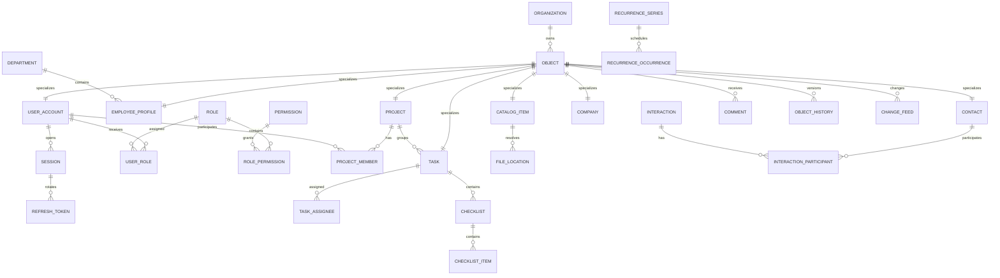

## 5.2. Пользователи и права

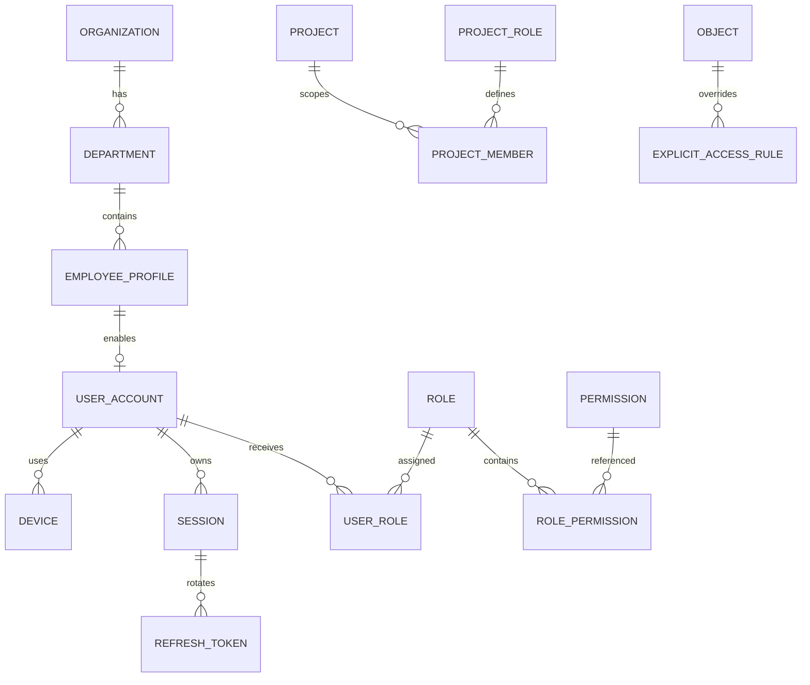

## 5.3. Проекты, задачи, календарь и напоминания

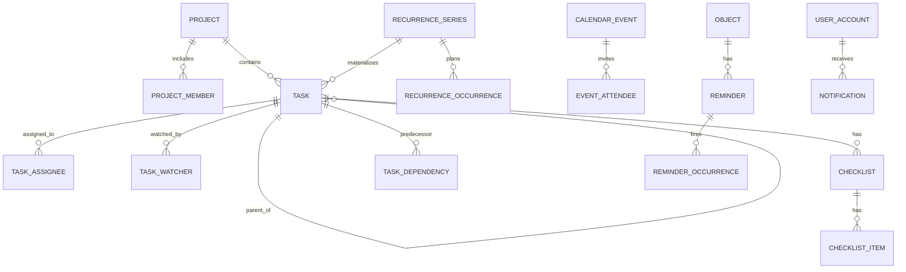

## 5.4. Файлы, контакты, аудит

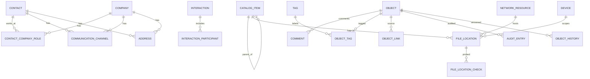

**Удаление:** ссылки aggregate-internal используют `CASCADE`; бизнес-корни `RESTRICT` через `core.objects`; необязательные акторы и внешние references используют `SET NULL`. Физический файл никогда не является целью FK или cascade.

# 6. Проектирование физической схемы PostgreSQL

Нормативный DDL расположен в `db/001_initial_schema.sql`; исправления аудита — в `db/003_audit_corrections.sql`. Полный построчный справочник каждой таблицы приведён в `05_physical_schema_reference.md`.

| Метрика | Значение |
| --- | ---: |
| Схемы PostgreSQL | 14 |
| Таблицы и default partitions | 74 |
| Индексы | 106 |
| Extension | `citext`, `pg_trgm`, `unaccent` |
| Общая object identity | `core.objects` |
| Audit/history | range-partitioned по времени |

Критические ограничения реализуются в БД: уникальный login/email, один primary assignee, уникальный recurrence occurrence, CHECK состояний, FK delete policy, частичные индексы для active/due/pending наборов. Инварианты, требующие графа или текущего пользователя (циклы отделов/задач, глубина подзадачи, policy checks), дополнительно проверяются application layer в той же транзакции.

# 7. Идентификаторы

| Вариант | Плюсы | Минусы | Решение |
| --- | --- | --- | --- |
| UUIDv4 | client generation, не раскрывает count | случайная вставка B-tree, хуже locality | отклонён |
| UUIDv7 | client generation, time-ordered, стандарт RFC 9562 | нужна библиотека и защита clock rollback | **выбран** |
| bigint | компактный и быстрый | центральная выдача, неудобен offline/client IDs, перечислимость | только внутренние sequence/cursor |
| ULID | сортируемый, читаемый | не native PostgreSQL uuid, варианты кодировки/case | отклонён |

UUIDv7 создаётся application layer, не функцией БД. Desktop может заранее создать ID для online-команды и безопасно повторить её с `Idempotency-Key`. Индексная локальность лучше v4; безопасность не основывается на непредсказуемости ID, поэтому BOLA всегда закрывается policy-filtering.

# 8. Даты, время и часовые пояса

- `created_at`, `updated_at`, deadline, delivery, audit: `timestamptz`, UTC.
- День задачи без времени: `scheduled_date date`, интерпретируется в `schedule_time_zone`.
- Задача со временем хранит одновременно local tuple (`date`, `time`, IANA zone) и вычисленный `start_at_utc`; сервер проверяет согласованность.
- Duration: целые минуты, не timestamp end; end вычисляется, чтобы перенос timezone не менял длительность.
- Recurrence хранит local rule + timezone. DST gap сдвигается на первый валидный local instant; overlap выбирает ранний offset и сохраняет resolved UTC в occurrence ledger.
- При смене timezone устройства уже материализованные instants не меняются; UI только конвертирует отображение. Серия продолжает использовать timezone серии, пока пользователь явно её не изменит.

# 9. Статусы и конечные автоматы

## 9.1. User / Session
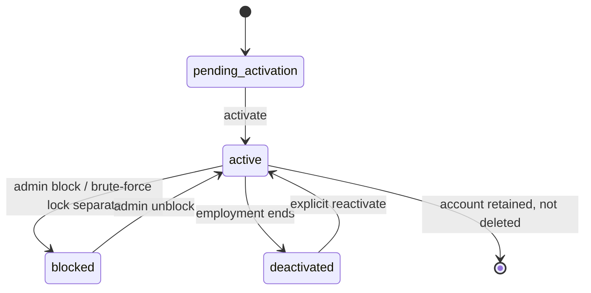
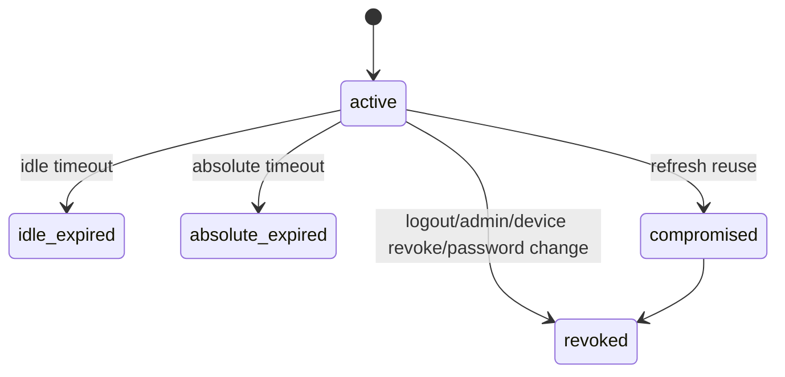

## 9.2. Project / Task
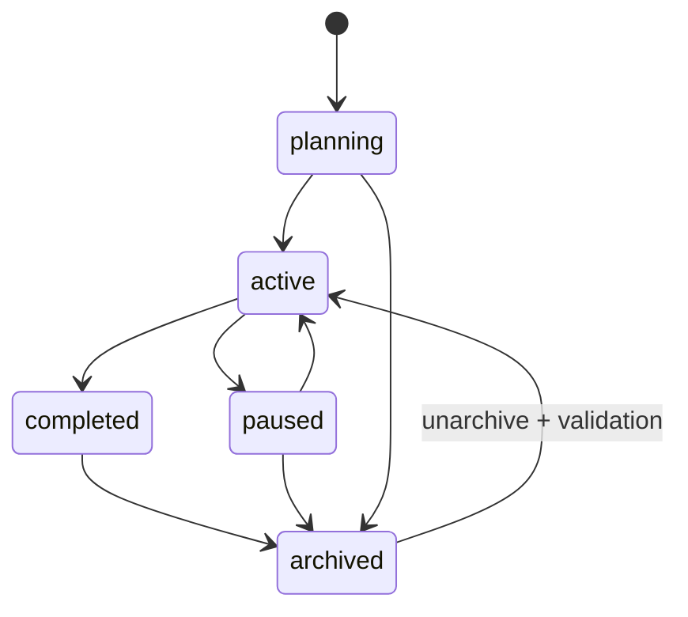
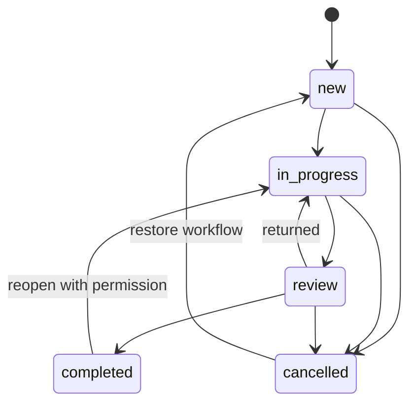
Просрочка не состояние: `deadline_at < now AND status NOT IN (completed,cancelled)`.

## 9.3. Recurrence, reminder, notification, file location, trash
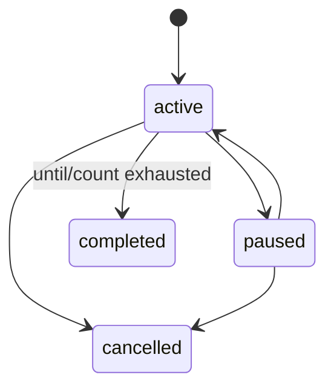
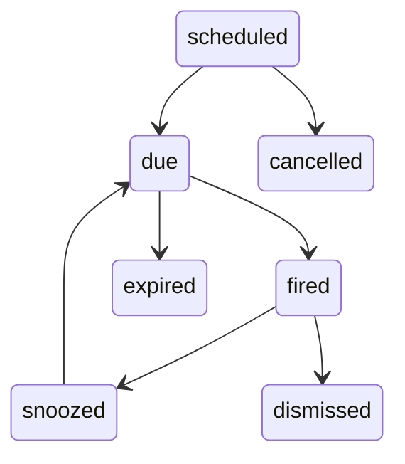
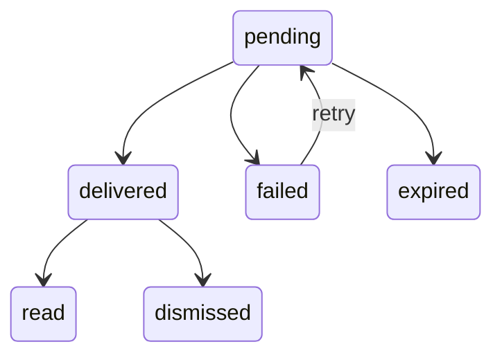
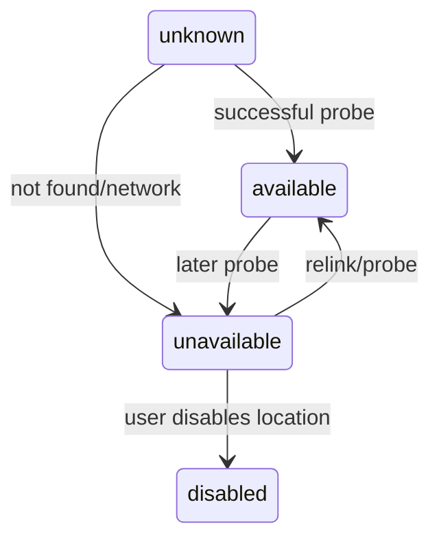
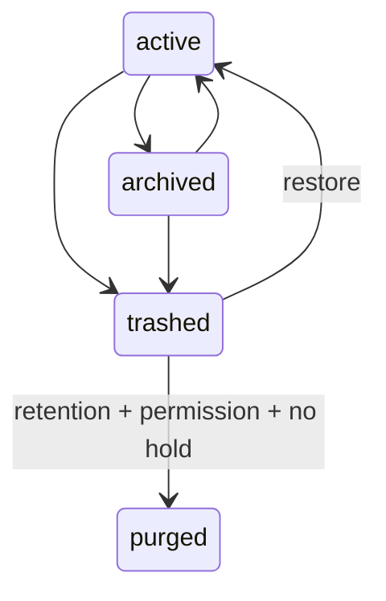

Каждый transition выполняет: policy check → expected version → invariant check → state/timestamps → history/audit/domain-event/outbox → commit. Change feed строится после commit идемпотентным projector. Запрещённый переход возвращает `409 INVALID_STATE_TRANSITION`.

# 10. Задачи и иерархия

- Task и Subtask используют `work.tasks`; `parent_task_id` допускает только один уровень. Триггер/сервис запрещает parent, у которого уже есть parent.
- `author_user_id` — смысловой автор; `creator_user_id` — фактический создатель записи; `requester_user_id` — постановщик. Они не объединяются.
- Исполнителей несколько; один может быть primary. Наблюдатели отдельны и не получают право редактирования автоматически.
- `scheduled_date` отвечает «в какой день показывать»; `start_at_utc` — точный старт; `deadline_at` — последний допустимый instant; `planned_duration_minutes` — плановая занятость; `completed_at` — факт; Reminder — отдельное пользовательское срабатывание.
- Dependencies в MVP только finish-to-start и не блокируют технически смену статуса без политики проекта; API возвращает warning/validation в зависимости от настройки.
- Порядок subtasks/checklist items — fractional numeric order; при исчерпании промежутка сервер атомарно нормализует ключи.
- Архив и корзина запрещают обычное изменение; restore валидирует существование проекта/parent и права.

# 11. Повторяющиеся задачи

**Выбран подход:** серия + occurrence ledger + материализованные обычные Task. Виртуальная генерация только на чтении отклонена, потому что экземпляру нужны assignees, comments, reminders, independent status и audit.

Алгоритм генерации:
1. Worker получает advisory lock по `series_id`.
2. Загружает rule, timezone, `generated_through_local`, count/until и exceptions.
3. Вычисляет occurrence keys до `max(now+90d, 20 instances)`.
4. Для каждого key вставляет ledger `ON CONFLICT DO NOTHING`.
5. Если не skipped, создаёт Task с уникальным `(series_id, occurrence_key)`.
6. Создаёт reminders и outbox в той же tx одного batch; batch ≤100.
7. Обновляет horizon/version series после успешного batch.

Изменение scope:
- `one`: task становится exception, series не меняется.
- `this_and_future`: текущая series обрезается до предыдущего occurrence; создаётся новая series с новым шаблоном; текущий и будущие незавершённые tasks переводятся/перегенерируются батчами.
- `all`: меняется template; materialized future tasks без пользовательских изменений обновляются; modified exceptions сохраняются.
- Пропущенные worker runs догоняются, но не создают дубли благодаря ledger и unique key.

# 12. Календарная модель

`CalendarEvent` — отдельная сущность для встреч без статуса исполнения. `ScheduleItem` — не таблица, а авторизационная read projection из Task + CalendarEvent.

Диапазоны API: day ≤2 дней, week ≤14, month ≤62, arbitrary ≤366. Month query возвращает только поля карточек; полная карточка загружается отдельно. Пересечения разрешены и вычисляются по half-open interval `[start,end)`.

Ключевые индексы: `tasks(organization_id, scheduled_date, start_at_utc)`, partial open deadlines, `calendar_events(organization_id,start_at_utc,end_at_utc)`, assignee/user indexes. Department calendar сначала получает допустимые user IDs, затем делает set-based join; N+1 запрещён.

# 13. Каталог файлов и многопутевая модель

**Хранится:** имя, вид, описание, virtual parent, extension/media metadata, size/hash при наличии, location URI, device/network scope, priority, availability per device, links/tags/audit.  
**Не хранится:** рабочие bytes, Windows credentials, SMB password, копия файла, ACL, произвольный executable command.

Алгоритм выбора location на desktop:
```text
candidates = server-authorized active locations
filter by current device OR network/global scope
reject non-allowlisted scheme/root and traversal/canonicalization anomalies
rank: exact device local > reachable UNC > mapped-drive for device > other allowed
within class: explicit priority DESC, last_success DESC, id ASC
probe asynchronously with 2s metadata timeout, never enumerate parent tree
open first available; otherwise return categorized failure and relink actions
```

Relink меняет только metadata. Переименование/перемещение через Explorer не отслеживается. Удаление CatalogItem не вызывает filesystem delete. Windows/SMB ACL проверяются ОС под текущим пользователем после серверного разрешения metadata.

# 14. Контакты и контрагенты

Person и Company — отдельные корни, потому что имеют разные identity/lifecycle, но communication channels и addresses нормализованы и polymorphic-owner ограничен application invariant. `contact_company_roles` поддерживает несколько компаний/должностей и одну primary active role. В задаче один основной контрагент хранится FK на `core.objects`, дополнительные contacts — `collab.object_links`.

Interaction содержит тип (`call`, `meeting`, `email`, `agreement`, `comment`, `next_step`), occurred_at, summary/details, next step и participants. Интеграция с почтой отсутствует; email interaction вводится вручную.

# 15. Комментарии, аудит и история изменений

| Понятие | Таблица | Изменяемость | Видимость | Retention |
| --- | --- | --- | --- | --- |
| Пользовательский комментарий | `collab.comments` | автор редактирует; old version сохраняется | по правам target object | пока объект/политика |
| Технический аудит | `governance.audit_entries` | append-only | Audit.ReadAll/SecurityAudit.Read | 7 лет default |
| История объекта | `governance.object_history` | append-only | текущие права на объект | 3 года default |
| Доменное событие | `governance.domain_events` | append-only | internal | 90–365 дней |
| Integration delivery | `governance.outbox_messages` | state machine only | internal ops | 30 дней после publish |

Полный event sourcing отклонён: стоимость реконструкции и миграций не оправдана. Выбран current state + JSON Patch + периодический snapshot. Secrets, hashes, token values, raw file credentials, full comment text в security logs и необработанный exception stack клиенту запрещены.

# 16. Авторизация и сессии

- Password: Argon2id, per-user salt, параметры в строке/JSON; baseline 64–128 MiB, 3 iterations, parallelism 2, калибруется до 250–500 ms на сервере.
- Access token: подписанный JWT 5 минут, содержит user/session/organization/credentialVersion/scopeVersion, но не полный permission list.
- Refresh token: opaque 256-bit, hash в БД, rotating one-time use; reuse компрометирует family и отзывает session.
- Серверная session обязательна: JWT alone отклонён из-за немедленной блокировки/отзыва в локальной корпоративной системе.
- Desktop хранит refresh secret в Windows Credential Manager/DPAPI; access token только в памяти.
- Idle timeout 8 часов default, absolute 30 дней; администратор может уменьшить.
- Brute force: rate limit login/IP/device/login; progressive delay; временный lock; одинаковый ответ для неизвестного login и неверного пароля.
- Password change/reset увеличивает credential_version и отзывает остальные sessions.

# 17. Модель прав доступа

## 17.1. Decision pipeline

```text
1. authenticated active session + active account/device
2. organization boundary
3. object exists and visible lifecycle
4. explicit deny (user/role/department) -> deny
5. administrative permission with mandatory audit -> allow if condition passes
6. project relation/role and permission overrides
7. department-scoped role and manager relation
8. object relation: creator/requester/assignee/watcher/recipient/owner
9. ABAC: status, field set, time, target lifecycle, OS path policy
10. explicit allow / role allow
11. default deny
```

Explicit deny сильнее allow. Нельзя кэшировать решение дольше scope version; изменение ролей/участников/rules увеличивает `authorization_scope_versions`, публикует invalidation и вынуждает client purge/bootstrap.

## 17.2. Системные роли

| Действие | System admin | Manager | Employee | Observer |
| --- | --- | --- | --- | --- |
| Users/departments/roles | полный admin | read сотрудников своего scope | read directory | read directory |
| Projects | read all/manage allowed | create/manage свои и руководимые | scoped member rights | read scoped |
| Tasks | all with audited scope | department/project manage | create; own/assigned status/edit fields | read only |
| Files | metadata/manage roots | project metadata/location if granted | metadata/link/open if granted | metadata/open if granted |
| Contacts | all | project/department scope | scoped read/update by role | scoped read |
| Audit/backups/system | yes | object history only | object history only | object history only |

## 17.3. Project roles

| Permission group | Owner | Manager | Editor | Executor | Observer |
| --- | ---: | ---: | ---: | ---: | ---: |
| Project read | ✓ | ✓ | ✓ | ✓ | ✓ |
| Project update | ✓ | ✓ | limited | — | — |
| Members/ownership | ✓ | ✓ except ownership | — | — | — |
| Task create/update/assign | ✓ | ✓ | ✓ | own/assigned limited | — |
| File/contact metadata | ✓ | ✓ | ✓ | read/link allowed | read |
| Comments/history | ✓ | ✓ | ✓ | ✓ | read |

## 17.4. Матрица объектов

| Объект | Create | Read | Update | Delete/restore | Назначение/participants | History | Проверка |
| --- | --- | --- | --- | --- | --- | --- | --- |
| Project | Project.Create | member/ReadAll | owner/manager/editor policy | owner/admin | ManageMembers | current access | API policy + SQL scope |
| Task | Task.Create in scope | project/member/relation/dept | field-level by relation | creator/manager/admin | Task.Assign | current access | aggregate service |
| CatalogItem | FileCatalog.Create | catalog/project links | metadata role | owner/editor/admin | locations separate sensitive right | current access | API + OS ACL at open |
| Contact/Company | Contact.Create | linked project/dept/global role | role policy | Contact.Delete/Restore | relations via links | current access | CRM policy |
| Comment | target read + Comment.Create | target read | own or moderator | own or moderator | n/a | versions with target read | target authorization first |
| Notification | system only | recipient | read/dismiss own | no business trash | action delegates target command | own only | recipient + target recheck |

Полный список permission codes согласован с API и находится в `catalogs/permissions.csv`; seed — `003_audit_corrections.sql`.
