# Этап 2. Детальная модель данных, PostgreSQL, API, права и технические сценарии

**Продукт:** десктопный органайзер для одной компании  
**Статус:** нормативная техническая спецификация перед реализацией  
**Архитектурная база:** Этап 1, версия 1.0  
**Целевая БД:** PostgreSQL 16+  
**API:** REST `/api/v1`, OpenAPI 3.1.0  
**Идентификаторы:** UUIDv7, генерируются приложением  
**Конкурентность:** optimistic locking через ETag/If-Match  
**Синхронизация:** bootstrap + change feed + WebSocket invalidation  

> Нормативный приоритет: концепция определяет бизнес-функции; Этап 1 определяет архитектуру; данный пакет конкретизирует реализацию. При расхождении действует явно зафиксированное решение раздела 1.

# 22. Синхронизация desktop-клиентов

**Основной механизм:** WebSocket realtime invalidation поверх обязательного incremental sync. **Резерв:** polling `/sync/changes` каждые 30–60 секунд с exponential backoff. SSE отклонён из-за двусторонних reconnect/capability needs; long polling сложнее обычного cursor polling; локальная очередь writes в MVP запрещена.

Bootstrap создаёт short-lived `snapshot_session` с фиксированными `scopeVersion` и `cutSequence`. Страницы читаются по стабильным `(dataset,ordinal)` из materialized session items; concurrent writes не изменяют snapshot. После атомарной замены SQLite cache клиент выполняет incremental catch-up строго после `cutSequence`. Incremental feed упорядочен глобальным bigint sequence; payload минимален (`sourceEventId/objectType/id/operation/version`). Потеря WebSocket не теряет данные: после reconnect клиент запрашивает feed после durable cursor. `410 SYNC_CURSOR_EXPIRED` запускает purge+bootstrap. Изменение прав прекращает snapshot и возвращает `409 SYNC_SCOPE_CHANGED`, после чего чувствительные projections удаляются до нового bootstrap.

Локально разрешены доступные пользователю read projections, settings, notification schedule и file metadata; запрещены hashes, чужой audit, working file bytes и durable pending business commands.

# 23. Доменные события

| Event | Источник | Payload | Публикация | Delivery | Replay | Retention | Consumers |
| --- | --- | --- | --- | --- | --- | --- | --- |
| AllSessionsRevoked | auth | eventId, organizationId, aggregateId, aggregateType, aggregateVersion, occurredAt, actorId, correlationId, changedFields/minimal metadata | after DB commit via outbox | at-least-once | yes; eventId/inbox unique | 90 days domain / 30 days delivered outbox | change-feed projector; audit/history; notification/search/realtime as applicable |
| AuditExportRequested | audit | eventId, organizationId, aggregateId, aggregateType, aggregateVersion, occurredAt, actorId, correlationId, changedFields/minimal metadata | after DB commit via outbox | at-least-once | yes; eventId/inbox unique | 90 days domain / 30 days delivered outbox | change-feed projector; audit/history; notification/search/realtime as applicable |
| AuthorizationScopeChanged | worker/system | eventId, organizationId, aggregateId, aggregateType, aggregateVersion, occurredAt, actorId, correlationId, changedFields/minimal metadata | after DB commit via outbox | at-least-once | yes; eventId/inbox unique | 90 days domain / 30 days delivered outbox | change-feed projector; audit/history; notification/search/realtime as applicable |
| BackgroundJobRequested | admin | eventId, organizationId, aggregateId, aggregateType, aggregateVersion, occurredAt, actorId, correlationId, changedFields/minimal metadata | after DB commit via outbox | at-least-once | yes; eventId/inbox unique | 90 days domain / 30 days delivered outbox | change-feed projector; audit/history; notification/search/realtime as applicable |
| BackupCompleted | worker/system | eventId, organizationId, aggregateId, aggregateType, aggregateVersion, occurredAt, actorId, correlationId, changedFields/minimal metadata | after DB commit via outbox | at-least-once | yes; eventId/inbox unique | 90 days domain / 30 days delivered outbox | change-feed projector; audit/history; notification/search/realtime as applicable |
| BackupFailed | worker/system | eventId, organizationId, aggregateId, aggregateType, aggregateVersion, occurredAt, actorId, correlationId, changedFields/minimal metadata | after DB commit via outbox | at-least-once | yes; eventId/inbox unique | 90 days domain / 30 days delivered outbox | change-feed projector; audit/history; notification/search/realtime as applicable |
| BackupRequested | admin | eventId, organizationId, aggregateId, aggregateType, aggregateVersion, occurredAt, actorId, correlationId, changedFields/minimal metadata | after DB commit via outbox | at-least-once | yes; eventId/inbox unique | 90 days domain / 30 days delivered outbox | change-feed projector; audit/history; notification/search/realtime as applicable |
| BackupVerificationRequested | admin | eventId, organizationId, aggregateId, aggregateType, aggregateVersion, occurredAt, actorId, correlationId, changedFields/minimal metadata | after DB commit via outbox | at-least-once | yes; eventId/inbox unique | 90 days domain / 30 days delivered outbox | change-feed projector; audit/history; notification/search/realtime as applicable |
| CalendarAttendeesChanged | calendar | eventId, organizationId, aggregateId, aggregateType, aggregateVersion, occurredAt, actorId, correlationId, changedFields/minimal metadata | after DB commit via outbox | at-least-once | yes; eventId/inbox unique | 90 days domain / 30 days delivered outbox | change-feed projector; audit/history; notification/search/realtime as applicable |
| CalendarEventArchived | calendar | eventId, organizationId, aggregateId, aggregateType, aggregateVersion, occurredAt, actorId, correlationId, changedFields/minimal metadata | after DB commit via outbox | at-least-once | yes; eventId/inbox unique | 90 days domain / 30 days delivered outbox | change-feed projector; audit/history; notification/search/realtime as applicable |
| CalendarEventCreated | calendar | eventId, organizationId, aggregateId, aggregateType, aggregateVersion, occurredAt, actorId, correlationId, changedFields/minimal metadata | after DB commit via outbox | at-least-once | yes; eventId/inbox unique | 90 days domain / 30 days delivered outbox | change-feed projector; audit/history; notification/search/realtime as applicable |
| CalendarEventDeleted | calendar | eventId, organizationId, aggregateId, aggregateType, aggregateVersion, occurredAt, actorId, correlationId, changedFields/minimal metadata | after DB commit via outbox | at-least-once | yes; eventId/inbox unique | 90 days domain / 30 days delivered outbox | change-feed projector; audit/history; notification/search/realtime as applicable |
| CalendarEventRestored | calendar | eventId, organizationId, aggregateId, aggregateType, aggregateVersion, occurredAt, actorId, correlationId, changedFields/minimal metadata | after DB commit via outbox | at-least-once | yes; eventId/inbox unique | 90 days domain / 30 days delivered outbox | change-feed projector; audit/history; notification/search/realtime as applicable |
| CalendarEventUnarchived | calendar | eventId, organizationId, aggregateId, aggregateType, aggregateVersion, occurredAt, actorId, correlationId, changedFields/minimal metadata | after DB commit via outbox | at-least-once | yes; eventId/inbox unique | 90 days domain / 30 days delivered outbox | change-feed projector; audit/history; notification/search/realtime as applicable |
| CalendarEventUpdated | calendar | eventId, organizationId, aggregateId, aggregateType, aggregateVersion, occurredAt, actorId, correlationId, changedFields/minimal metadata | after DB commit via outbox | at-least-once | yes; eventId/inbox unique | 90 days domain / 30 days delivered outbox | change-feed projector; audit/history; notification/search/realtime as applicable |
| CalendarInvitationResponded | calendar | eventId, organizationId, aggregateId, aggregateType, aggregateVersion, occurredAt, actorId, correlationId, changedFields/minimal metadata | after DB commit via outbox | at-least-once | yes; eventId/inbox unique | 90 days domain / 30 days delivered outbox | change-feed projector; audit/history; notification/search/realtime as applicable |
| CatalogItemArchived | files | eventId, organizationId, aggregateId, aggregateType, aggregateVersion, occurredAt, actorId, correlationId, changedFields/minimal metadata | after DB commit via outbox | at-least-once | yes; eventId/inbox unique | 90 days domain / 30 days delivered outbox | change-feed projector; audit/history; notification/search/realtime as applicable |
| CatalogItemCreated | files | eventId, organizationId, aggregateId, aggregateType, aggregateVersion, occurredAt, actorId, correlationId, changedFields/minimal metadata | after DB commit via outbox | at-least-once | yes; eventId/inbox unique | 90 days domain / 30 days delivered outbox | change-feed projector; audit/history; notification/search/realtime as applicable |
| CatalogItemDeleted | files | eventId, organizationId, aggregateId, aggregateType, aggregateVersion, occurredAt, actorId, correlationId, changedFields/minimal metadata | after DB commit via outbox | at-least-once | yes; eventId/inbox unique | 90 days domain / 30 days delivered outbox | change-feed projector; audit/history; notification/search/realtime as applicable |
| CatalogItemMoved | files | eventId, organizationId, aggregateId, aggregateType, aggregateVersion, occurredAt, actorId, correlationId, changedFields/minimal metadata | after DB commit via outbox | at-least-once | yes; eventId/inbox unique | 90 days domain / 30 days delivered outbox | change-feed projector; audit/history; notification/search/realtime as applicable |
| CatalogItemRestored | files | eventId, organizationId, aggregateId, aggregateType, aggregateVersion, occurredAt, actorId, correlationId, changedFields/minimal metadata | after DB commit via outbox | at-least-once | yes; eventId/inbox unique | 90 days domain / 30 days delivered outbox | change-feed projector; audit/history; notification/search/realtime as applicable |
| CatalogItemUnarchived | files | eventId, organizationId, aggregateId, aggregateType, aggregateVersion, occurredAt, actorId, correlationId, changedFields/minimal metadata | after DB commit via outbox | at-least-once | yes; eventId/inbox unique | 90 days domain / 30 days delivered outbox | change-feed projector; audit/history; notification/search/realtime as applicable |
| CatalogItemUpdated | files | eventId, organizationId, aggregateId, aggregateType, aggregateVersion, occurredAt, actorId, correlationId, changedFields/minimal metadata | after DB commit via outbox | at-least-once | yes; eventId/inbox unique | 90 days domain / 30 days delivered outbox | change-feed projector; audit/history; notification/search/realtime as applicable |
| ChangeFeedCompactionRequested | admin | eventId, organizationId, aggregateId, aggregateType, aggregateVersion, occurredAt, actorId, correlationId, changedFields/minimal metadata | after DB commit via outbox | at-least-once | yes; eventId/inbox unique | 90 days domain / 30 days delivered outbox | change-feed projector; audit/history; notification/search/realtime as applicable |
| ChecklistCreated | checklists | eventId, organizationId, aggregateId, aggregateType, aggregateVersion, occurredAt, actorId, correlationId, changedFields/minimal metadata | after DB commit via outbox | at-least-once | yes; eventId/inbox unique | 90 days domain / 30 days delivered outbox | change-feed projector; audit/history; notification/search/realtime as applicable |
| ChecklistDeleted | checklists | eventId, organizationId, aggregateId, aggregateType, aggregateVersion, occurredAt, actorId, correlationId, changedFields/minimal metadata | after DB commit via outbox | at-least-once | yes; eventId/inbox unique | 90 days domain / 30 days delivered outbox | change-feed projector; audit/history; notification/search/realtime as applicable |
| ChecklistItemChanged | checklists | eventId, organizationId, aggregateId, aggregateType, aggregateVersion, occurredAt, actorId, correlationId, changedFields/minimal metadata | after DB commit via outbox | at-least-once | yes; eventId/inbox unique | 90 days domain / 30 days delivered outbox | change-feed projector; audit/history; notification/search/realtime as applicable |
| ChecklistItemCreated | checklists | eventId, organizationId, aggregateId, aggregateType, aggregateVersion, occurredAt, actorId, correlationId, changedFields/minimal metadata | after DB commit via outbox | at-least-once | yes; eventId/inbox unique | 90 days domain / 30 days delivered outbox | change-feed projector; audit/history; notification/search/realtime as applicable |
| ChecklistItemDeleted | checklists | eventId, organizationId, aggregateId, aggregateType, aggregateVersion, occurredAt, actorId, correlationId, changedFields/minimal metadata | after DB commit via outbox | at-least-once | yes; eventId/inbox unique | 90 days domain / 30 days delivered outbox | change-feed projector; audit/history; notification/search/realtime as applicable |
| ChecklistReordered | checklists | eventId, organizationId, aggregateId, aggregateType, aggregateVersion, occurredAt, actorId, correlationId, changedFields/minimal metadata | after DB commit via outbox | at-least-once | yes; eventId/inbox unique | 90 days domain / 30 days delivered outbox | change-feed projector; audit/history; notification/search/realtime as applicable |
| ChecklistUpdated | checklists | eventId, organizationId, aggregateId, aggregateType, aggregateVersion, occurredAt, actorId, correlationId, changedFields/minimal metadata | after DB commit via outbox | at-least-once | yes; eventId/inbox unique | 90 days domain / 30 days delivered outbox | change-feed projector; audit/history; notification/search/realtime as applicable |
| ClientVersionRejected | worker/system | eventId, organizationId, aggregateId, aggregateType, aggregateVersion, occurredAt, actorId, correlationId, changedFields/minimal metadata | after DB commit via outbox | at-least-once | yes; eventId/inbox unique | 90 days domain / 30 days delivered outbox | change-feed projector; audit/history; notification/search/realtime as applicable |
| CommentAdded | comments | eventId, organizationId, aggregateId, aggregateType, aggregateVersion, occurredAt, actorId, correlationId, changedFields/minimal metadata | after DB commit via outbox | at-least-once | yes; eventId/inbox unique | 90 days domain / 30 days delivered outbox | change-feed projector; audit/history; notification/search/realtime as applicable |
| CommentDeleted | comments | eventId, organizationId, aggregateId, aggregateType, aggregateVersion, occurredAt, actorId, correlationId, changedFields/minimal metadata | after DB commit via outbox | at-least-once | yes; eventId/inbox unique | 90 days domain / 30 days delivered outbox | change-feed projector; audit/history; notification/search/realtime as applicable |
| CommentEdited | comments | eventId, organizationId, aggregateId, aggregateType, aggregateVersion, occurredAt, actorId, correlationId, changedFields/minimal metadata | after DB commit via outbox | at-least-once | yes; eventId/inbox unique | 90 days domain / 30 days delivered outbox | change-feed projector; audit/history; notification/search/realtime as applicable |
| CommentRestored | comments | eventId, organizationId, aggregateId, aggregateType, aggregateVersion, occurredAt, actorId, correlationId, changedFields/minimal metadata | after DB commit via outbox | at-least-once | yes; eventId/inbox unique | 90 days domain / 30 days delivered outbox | change-feed projector; audit/history; notification/search/realtime as applicable |
| CompanyArchived | companies | eventId, organizationId, aggregateId, aggregateType, aggregateVersion, occurredAt, actorId, correlationId, changedFields/minimal metadata | after DB commit via outbox | at-least-once | yes; eventId/inbox unique | 90 days domain / 30 days delivered outbox | change-feed projector; audit/history; notification/search/realtime as applicable |
| CompanyContactLinked | companies | eventId, organizationId, aggregateId, aggregateType, aggregateVersion, occurredAt, actorId, correlationId, changedFields/minimal metadata | after DB commit via outbox | at-least-once | yes; eventId/inbox unique | 90 days domain / 30 days delivered outbox | change-feed projector; audit/history; notification/search/realtime as applicable |
| CompanyContactUnlinked | companies | eventId, organizationId, aggregateId, aggregateType, aggregateVersion, occurredAt, actorId, correlationId, changedFields/minimal metadata | after DB commit via outbox | at-least-once | yes; eventId/inbox unique | 90 days domain / 30 days delivered outbox | change-feed projector; audit/history; notification/search/realtime as applicable |
| CompanyCreated | companies | eventId, organizationId, aggregateId, aggregateType, aggregateVersion, occurredAt, actorId, correlationId, changedFields/minimal metadata | after DB commit via outbox | at-least-once | yes; eventId/inbox unique | 90 days domain / 30 days delivered outbox | change-feed projector; audit/history; notification/search/realtime as applicable |
| CompanyDeleted | companies | eventId, organizationId, aggregateId, aggregateType, aggregateVersion, occurredAt, actorId, correlationId, changedFields/minimal metadata | after DB commit via outbox | at-least-once | yes; eventId/inbox unique | 90 days domain / 30 days delivered outbox | change-feed projector; audit/history; notification/search/realtime as applicable |
| CompanyRestored | companies | eventId, organizationId, aggregateId, aggregateType, aggregateVersion, occurredAt, actorId, correlationId, changedFields/minimal metadata | after DB commit via outbox | at-least-once | yes; eventId/inbox unique | 90 days domain / 30 days delivered outbox | change-feed projector; audit/history; notification/search/realtime as applicable |
| CompanyUnarchived | companies | eventId, organizationId, aggregateId, aggregateType, aggregateVersion, occurredAt, actorId, correlationId, changedFields/minimal metadata | after DB commit via outbox | at-least-once | yes; eventId/inbox unique | 90 days domain / 30 days delivered outbox | change-feed projector; audit/history; notification/search/realtime as applicable |
| CompanyUpdated | companies | eventId, organizationId, aggregateId, aggregateType, aggregateVersion, occurredAt, actorId, correlationId, changedFields/minimal metadata | after DB commit via outbox | at-least-once | yes; eventId/inbox unique | 90 days domain / 30 days delivered outbox | change-feed projector; audit/history; notification/search/realtime as applicable |
| ContactAddressAdded | contacts | eventId, organizationId, aggregateId, aggregateType, aggregateVersion, occurredAt, actorId, correlationId, changedFields/minimal metadata | after DB commit via outbox | at-least-once | yes; eventId/inbox unique | 90 days domain / 30 days delivered outbox | change-feed projector; audit/history; notification/search/realtime as applicable |
| ContactArchived | contacts | eventId, organizationId, aggregateId, aggregateType, aggregateVersion, occurredAt, actorId, correlationId, changedFields/minimal metadata | after DB commit via outbox | at-least-once | yes; eventId/inbox unique | 90 days domain / 30 days delivered outbox | change-feed projector; audit/history; notification/search/realtime as applicable |
| ContactChannelAdded | contacts | eventId, organizationId, aggregateId, aggregateType, aggregateVersion, occurredAt, actorId, correlationId, changedFields/minimal metadata | after DB commit via outbox | at-least-once | yes; eventId/inbox unique | 90 days domain / 30 days delivered outbox | change-feed projector; audit/history; notification/search/realtime as applicable |
| ContactChannelChanged | contacts | eventId, organizationId, aggregateId, aggregateType, aggregateVersion, occurredAt, actorId, correlationId, changedFields/minimal metadata | after DB commit via outbox | at-least-once | yes; eventId/inbox unique | 90 days domain / 30 days delivered outbox | change-feed projector; audit/history; notification/search/realtime as applicable |
| ContactChannelDeleted | contacts | eventId, organizationId, aggregateId, aggregateType, aggregateVersion, occurredAt, actorId, correlationId, changedFields/minimal metadata | after DB commit via outbox | at-least-once | yes; eventId/inbox unique | 90 days domain / 30 days delivered outbox | change-feed projector; audit/history; notification/search/realtime as applicable |
| ContactCreated | contacts | eventId, organizationId, aggregateId, aggregateType, aggregateVersion, occurredAt, actorId, correlationId, changedFields/minimal metadata | after DB commit via outbox | at-least-once | yes; eventId/inbox unique | 90 days domain / 30 days delivered outbox | change-feed projector; audit/history; notification/search/realtime as applicable |
| ContactDeleted | contacts | eventId, organizationId, aggregateId, aggregateType, aggregateVersion, occurredAt, actorId, correlationId, changedFields/minimal metadata | after DB commit via outbox | at-least-once | yes; eventId/inbox unique | 90 days domain / 30 days delivered outbox | change-feed projector; audit/history; notification/search/realtime as applicable |
| ContactRestored | contacts | eventId, organizationId, aggregateId, aggregateType, aggregateVersion, occurredAt, actorId, correlationId, changedFields/minimal metadata | after DB commit via outbox | at-least-once | yes; eventId/inbox unique | 90 days domain / 30 days delivered outbox | change-feed projector; audit/history; notification/search/realtime as applicable |
| ContactUnarchived | contacts | eventId, organizationId, aggregateId, aggregateType, aggregateVersion, occurredAt, actorId, correlationId, changedFields/minimal metadata | after DB commit via outbox | at-least-once | yes; eventId/inbox unique | 90 days domain / 30 days delivered outbox | change-feed projector; audit/history; notification/search/realtime as applicable |
| ContactUpdated | contacts | eventId, organizationId, aggregateId, aggregateType, aggregateVersion, occurredAt, actorId, correlationId, changedFields/minimal metadata | after DB commit via outbox | at-least-once | yes; eventId/inbox unique | 90 days domain / 30 days delivered outbox | change-feed projector; audit/history; notification/search/realtime as applicable |
| DepartmentArchived | departments | eventId, organizationId, aggregateId, aggregateType, aggregateVersion, occurredAt, actorId, correlationId, changedFields/minimal metadata | after DB commit via outbox | at-least-once | yes; eventId/inbox unique | 90 days domain / 30 days delivered outbox | change-feed projector; audit/history; notification/search/realtime as applicable |
| DepartmentCreated | departments | eventId, organizationId, aggregateId, aggregateType, aggregateVersion, occurredAt, actorId, correlationId, changedFields/minimal metadata | after DB commit via outbox | at-least-once | yes; eventId/inbox unique | 90 days domain / 30 days delivered outbox | change-feed projector; audit/history; notification/search/realtime as applicable |
| DepartmentDeleted | departments | eventId, organizationId, aggregateId, aggregateType, aggregateVersion, occurredAt, actorId, correlationId, changedFields/minimal metadata | after DB commit via outbox | at-least-once | yes; eventId/inbox unique | 90 days domain / 30 days delivered outbox | change-feed projector; audit/history; notification/search/realtime as applicable |
| DepartmentManagersChanged | departments | eventId, organizationId, aggregateId, aggregateType, aggregateVersion, occurredAt, actorId, correlationId, changedFields/minimal metadata | after DB commit via outbox | at-least-once | yes; eventId/inbox unique | 90 days domain / 30 days delivered outbox | change-feed projector; audit/history; notification/search/realtime as applicable |
| DepartmentRestored | departments | eventId, organizationId, aggregateId, aggregateType, aggregateVersion, occurredAt, actorId, correlationId, changedFields/minimal metadata | after DB commit via outbox | at-least-once | yes; eventId/inbox unique | 90 days domain / 30 days delivered outbox | change-feed projector; audit/history; notification/search/realtime as applicable |
| DepartmentUnarchived | departments | eventId, organizationId, aggregateId, aggregateType, aggregateVersion, occurredAt, actorId, correlationId, changedFields/minimal metadata | after DB commit via outbox | at-least-once | yes; eventId/inbox unique | 90 days domain / 30 days delivered outbox | change-feed projector; audit/history; notification/search/realtime as applicable |
| DepartmentUpdated | departments | eventId, organizationId, aggregateId, aggregateType, aggregateVersion, occurredAt, actorId, correlationId, changedFields/minimal metadata | after DB commit via outbox | at-least-once | yes; eventId/inbox unique | 90 days domain / 30 days delivered outbox | change-feed projector; audit/history; notification/search/realtime as applicable |
| DeviceRevoked | devices | eventId, organizationId, aggregateId, aggregateType, aggregateVersion, occurredAt, actorId, correlationId, changedFields/minimal metadata | after DB commit via outbox | at-least-once | yes; eventId/inbox unique | 90 days domain / 30 days delivered outbox | change-feed projector; audit/history; notification/search/realtime as applicable |
| DeviceUpdated | devices | eventId, organizationId, aggregateId, aggregateType, aggregateVersion, occurredAt, actorId, correlationId, changedFields/minimal metadata | after DB commit via outbox | at-least-once | yes; eventId/inbox unique | 90 days domain / 30 days delivered outbox | change-feed projector; audit/history; notification/search/realtime as applicable |
| FeatureFlagChanged | admin | eventId, organizationId, aggregateId, aggregateType, aggregateVersion, occurredAt, actorId, correlationId, changedFields/minimal metadata | after DB commit via outbox | at-least-once | yes; eventId/inbox unique | 90 days domain / 30 days delivered outbox | change-feed projector; audit/history; notification/search/realtime as applicable |
| FileLocationAdded | files | eventId, organizationId, aggregateId, aggregateType, aggregateVersion, occurredAt, actorId, correlationId, changedFields/minimal metadata | after DB commit via outbox | at-least-once | yes; eventId/inbox unique | 90 days domain / 30 days delivered outbox | change-feed projector; audit/history; notification/search/realtime as applicable |
| FileLocationAvailabilityChanged | worker/system | eventId, organizationId, aggregateId, aggregateType, aggregateVersion, occurredAt, actorId, correlationId, changedFields/minimal metadata | after DB commit via outbox | at-least-once | yes; eventId/inbox unique | 90 days domain / 30 days delivered outbox | change-feed projector; audit/history; notification/search/realtime as applicable |
| FileLocationChanged | files | eventId, organizationId, aggregateId, aggregateType, aggregateVersion, occurredAt, actorId, correlationId, changedFields/minimal metadata | after DB commit via outbox | at-least-once | yes; eventId/inbox unique | 90 days domain / 30 days delivered outbox | change-feed projector; audit/history; notification/search/realtime as applicable |
| FileLocationChecked | files | eventId, organizationId, aggregateId, aggregateType, aggregateVersion, occurredAt, actorId, correlationId, changedFields/minimal metadata | after DB commit via outbox | at-least-once | yes; eventId/inbox unique | 90 days domain / 30 days delivered outbox | change-feed projector; audit/history; notification/search/realtime as applicable |
| FileLocationRemoved | files | eventId, organizationId, aggregateId, aggregateType, aggregateVersion, occurredAt, actorId, correlationId, changedFields/minimal metadata | after DB commit via outbox | at-least-once | yes; eventId/inbox unique | 90 days domain / 30 days delivered outbox | change-feed projector; audit/history; notification/search/realtime as applicable |
| FileOpenRequested | files | eventId, organizationId, aggregateId, aggregateType, aggregateVersion, occurredAt, actorId, correlationId, changedFields/minimal metadata | after DB commit via outbox | at-least-once | yes; eventId/inbox unique | 90 days domain / 30 days delivered outbox | change-feed projector; audit/history; notification/search/realtime as applicable |
| InboxItemConvertedToCatalog | inbox | eventId, organizationId, aggregateId, aggregateType, aggregateVersion, occurredAt, actorId, correlationId, changedFields/minimal metadata | after DB commit via outbox | at-least-once | yes; eventId/inbox unique | 90 days domain / 30 days delivered outbox | change-feed projector; audit/history; notification/search/realtime as applicable |
| InboxItemConvertedToTask | inbox | eventId, organizationId, aggregateId, aggregateType, aggregateVersion, occurredAt, actorId, correlationId, changedFields/minimal metadata | after DB commit via outbox | at-least-once | yes; eventId/inbox unique | 90 days domain / 30 days delivered outbox | change-feed projector; audit/history; notification/search/realtime as applicable |
| InboxItemCreated | inbox | eventId, organizationId, aggregateId, aggregateType, aggregateVersion, occurredAt, actorId, correlationId, changedFields/minimal metadata | after DB commit via outbox | at-least-once | yes; eventId/inbox unique | 90 days domain / 30 days delivered outbox | change-feed projector; audit/history; notification/search/realtime as applicable |
| InboxItemDeleted | inbox | eventId, organizationId, aggregateId, aggregateType, aggregateVersion, occurredAt, actorId, correlationId, changedFields/minimal metadata | after DB commit via outbox | at-least-once | yes; eventId/inbox unique | 90 days domain / 30 days delivered outbox | change-feed projector; audit/history; notification/search/realtime as applicable |
| InboxItemRestored | inbox | eventId, organizationId, aggregateId, aggregateType, aggregateVersion, occurredAt, actorId, correlationId, changedFields/minimal metadata | after DB commit via outbox | at-least-once | yes; eventId/inbox unique | 90 days domain / 30 days delivered outbox | change-feed projector; audit/history; notification/search/realtime as applicable |
| InboxItemUpdated | inbox | eventId, organizationId, aggregateId, aggregateType, aggregateVersion, occurredAt, actorId, correlationId, changedFields/minimal metadata | after DB commit via outbox | at-least-once | yes; eventId/inbox unique | 90 days domain / 30 days delivered outbox | change-feed projector; audit/history; notification/search/realtime as applicable |
| InteractionCreated | interactions | eventId, organizationId, aggregateId, aggregateType, aggregateVersion, occurredAt, actorId, correlationId, changedFields/minimal metadata | after DB commit via outbox | at-least-once | yes; eventId/inbox unique | 90 days domain / 30 days delivered outbox | change-feed projector; audit/history; notification/search/realtime as applicable |
| InteractionDeleted | interactions | eventId, organizationId, aggregateId, aggregateType, aggregateVersion, occurredAt, actorId, correlationId, changedFields/minimal metadata | after DB commit via outbox | at-least-once | yes; eventId/inbox unique | 90 days domain / 30 days delivered outbox | change-feed projector; audit/history; notification/search/realtime as applicable |
| InteractionParticipantsChanged | interactions | eventId, organizationId, aggregateId, aggregateType, aggregateVersion, occurredAt, actorId, correlationId, changedFields/minimal metadata | after DB commit via outbox | at-least-once | yes; eventId/inbox unique | 90 days domain / 30 days delivered outbox | change-feed projector; audit/history; notification/search/realtime as applicable |
| InteractionRestored | interactions | eventId, organizationId, aggregateId, aggregateType, aggregateVersion, occurredAt, actorId, correlationId, changedFields/minimal metadata | after DB commit via outbox | at-least-once | yes; eventId/inbox unique | 90 days domain / 30 days delivered outbox | change-feed projector; audit/history; notification/search/realtime as applicable |
| InteractionUpdated | interactions | eventId, organizationId, aggregateId, aggregateType, aggregateVersion, occurredAt, actorId, correlationId, changedFields/minimal metadata | after DB commit via outbox | at-least-once | yes; eventId/inbox unique | 90 days domain / 30 days delivered outbox | change-feed projector; audit/history; notification/search/realtime as applicable |
| MaintenanceModeChanged | admin | eventId, organizationId, aggregateId, aggregateType, aggregateVersion, occurredAt, actorId, correlationId, changedFields/minimal metadata | after DB commit via outbox | at-least-once | yes; eventId/inbox unique | 90 days domain / 30 days delivered outbox | change-feed projector; audit/history; notification/search/realtime as applicable |
| NetworkResourceChanged | files | eventId, organizationId, aggregateId, aggregateType, aggregateVersion, occurredAt, actorId, correlationId, changedFields/minimal metadata | after DB commit via outbox | at-least-once | yes; eventId/inbox unique | 90 days domain / 30 days delivered outbox | change-feed projector; audit/history; notification/search/realtime as applicable |
| NetworkResourceCreated | files | eventId, organizationId, aggregateId, aggregateType, aggregateVersion, occurredAt, actorId, correlationId, changedFields/minimal metadata | after DB commit via outbox | at-least-once | yes; eventId/inbox unique | 90 days domain / 30 days delivered outbox | change-feed projector; audit/history; notification/search/realtime as applicable |
| NetworkResourceProbed | files | eventId, organizationId, aggregateId, aggregateType, aggregateVersion, occurredAt, actorId, correlationId, changedFields/minimal metadata | after DB commit via outbox | at-least-once | yes; eventId/inbox unique | 90 days domain / 30 days delivered outbox | change-feed projector; audit/history; notification/search/realtime as applicable |
| NotificationActionExecuted | notifications | eventId, organizationId, aggregateId, aggregateType, aggregateVersion, occurredAt, actorId, correlationId, changedFields/minimal metadata | after DB commit via outbox | at-least-once | yes; eventId/inbox unique | 90 days domain / 30 days delivered outbox | change-feed projector; audit/history; notification/search/realtime as applicable |
| NotificationDelivered | worker/system | eventId, organizationId, aggregateId, aggregateType, aggregateVersion, occurredAt, actorId, correlationId, changedFields/minimal metadata | after DB commit via outbox | at-least-once | yes; eventId/inbox unique | 90 days domain / 30 days delivered outbox | change-feed projector; audit/history; notification/search/realtime as applicable |
| NotificationDeliveryRequested | worker/system | eventId, organizationId, aggregateId, aggregateType, aggregateVersion, occurredAt, actorId, correlationId, changedFields/minimal metadata | after DB commit via outbox | at-least-once | yes; eventId/inbox unique | 90 days domain / 30 days delivered outbox | change-feed projector; audit/history; notification/search/realtime as applicable |
| NotificationPreferencesChanged | notifications | eventId, organizationId, aggregateId, aggregateType, aggregateVersion, occurredAt, actorId, correlationId, changedFields/minimal metadata | after DB commit via outbox | at-least-once | yes; eventId/inbox unique | 90 days domain / 30 days delivered outbox | change-feed projector; audit/history; notification/search/realtime as applicable |
| NotificationRead | notifications | eventId, organizationId, aggregateId, aggregateType, aggregateVersion, occurredAt, actorId, correlationId, changedFields/minimal metadata | after DB commit via outbox | at-least-once | yes; eventId/inbox unique | 90 days domain / 30 days delivered outbox | change-feed projector; audit/history; notification/search/realtime as applicable |
| NotificationsRead | notifications | eventId, organizationId, aggregateId, aggregateType, aggregateVersion, occurredAt, actorId, correlationId, changedFields/minimal metadata | after DB commit via outbox | at-least-once | yes; eventId/inbox unique | 90 days domain / 30 days delivered outbox | change-feed projector; audit/history; notification/search/realtime as applicable |
| ObjectLinked | tags | eventId, organizationId, aggregateId, aggregateType, aggregateVersion, occurredAt, actorId, correlationId, changedFields/minimal metadata | after DB commit via outbox | at-least-once | yes; eventId/inbox unique | 90 days domain / 30 days delivered outbox | change-feed projector; audit/history; notification/search/realtime as applicable |
| ObjectPurgeRequested | trash | eventId, organizationId, aggregateId, aggregateType, aggregateVersion, occurredAt, actorId, correlationId, changedFields/minimal metadata | after DB commit via outbox | at-least-once | yes; eventId/inbox unique | 90 days domain / 30 days delivered outbox | change-feed projector; audit/history; notification/search/realtime as applicable |
| ObjectRestored | trash | eventId, organizationId, aggregateId, aggregateType, aggregateVersion, occurredAt, actorId, correlationId, changedFields/minimal metadata | after DB commit via outbox | at-least-once | yes; eventId/inbox unique | 90 days domain / 30 days delivered outbox | change-feed projector; audit/history; notification/search/realtime as applicable |
| ObjectTagsChanged | tags | eventId, organizationId, aggregateId, aggregateType, aggregateVersion, occurredAt, actorId, correlationId, changedFields/minimal metadata | after DB commit via outbox | at-least-once | yes; eventId/inbox unique | 90 days domain / 30 days delivered outbox | change-feed projector; audit/history; notification/search/realtime as applicable |
| ObjectUnarchived | archive | eventId, organizationId, aggregateId, aggregateType, aggregateVersion, occurredAt, actorId, correlationId, changedFields/minimal metadata | after DB commit via outbox | at-least-once | yes; eventId/inbox unique | 90 days domain / 30 days delivered outbox | change-feed projector; audit/history; notification/search/realtime as applicable |
| ObjectUnlinked | tags | eventId, organizationId, aggregateId, aggregateType, aggregateVersion, occurredAt, actorId, correlationId, changedFields/minimal metadata | after DB commit via outbox | at-least-once | yes; eventId/inbox unique | 90 days domain / 30 days delivered outbox | change-feed projector; audit/history; notification/search/realtime as applicable |
| OrganizationSettingsChanged | settings | eventId, organizationId, aggregateId, aggregateType, aggregateVersion, occurredAt, actorId, correlationId, changedFields/minimal metadata | after DB commit via outbox | at-least-once | yes; eventId/inbox unique | 90 days domain / 30 days delivered outbox | change-feed projector; audit/history; notification/search/realtime as applicable |
| PasswordChanged | auth | eventId, organizationId, aggregateId, aggregateType, aggregateVersion, occurredAt, actorId, correlationId, changedFields/minimal metadata | after DB commit via outbox | at-least-once | yes; eventId/inbox unique | 90 days domain / 30 days delivered outbox | change-feed projector; audit/history; notification/search/realtime as applicable |
| PasswordResetByAdmin | auth | eventId, organizationId, aggregateId, aggregateType, aggregateVersion, occurredAt, actorId, correlationId, changedFields/minimal metadata | after DB commit via outbox | at-least-once | yes; eventId/inbox unique | 90 days domain / 30 days delivered outbox | change-feed projector; audit/history; notification/search/realtime as applicable |
| ProjectArchived | projects | eventId, organizationId, aggregateId, aggregateType, aggregateVersion, occurredAt, actorId, correlationId, changedFields/minimal metadata | after DB commit via outbox | at-least-once | yes; eventId/inbox unique | 90 days domain / 30 days delivered outbox | change-feed projector; audit/history; notification/search/realtime as applicable |
| ProjectCreated | projects | eventId, organizationId, aggregateId, aggregateType, aggregateVersion, occurredAt, actorId, correlationId, changedFields/minimal metadata | after DB commit via outbox | at-least-once | yes; eventId/inbox unique | 90 days domain / 30 days delivered outbox | change-feed projector; audit/history; notification/search/realtime as applicable |
| ProjectDeleted | projects | eventId, organizationId, aggregateId, aggregateType, aggregateVersion, occurredAt, actorId, correlationId, changedFields/minimal metadata | after DB commit via outbox | at-least-once | yes; eventId/inbox unique | 90 days domain / 30 days delivered outbox | change-feed projector; audit/history; notification/search/realtime as applicable |
| ProjectMemberAdded | projects | eventId, organizationId, aggregateId, aggregateType, aggregateVersion, occurredAt, actorId, correlationId, changedFields/minimal metadata | after DB commit via outbox | at-least-once | yes; eventId/inbox unique | 90 days domain / 30 days delivered outbox | change-feed projector; audit/history; notification/search/realtime as applicable |
| ProjectMemberPermissionsChanged | projects | eventId, organizationId, aggregateId, aggregateType, aggregateVersion, occurredAt, actorId, correlationId, changedFields/minimal metadata | after DB commit via outbox | at-least-once | yes; eventId/inbox unique | 90 days domain / 30 days delivered outbox | change-feed projector; audit/history; notification/search/realtime as applicable |
| ProjectMemberRemoved | projects | eventId, organizationId, aggregateId, aggregateType, aggregateVersion, occurredAt, actorId, correlationId, changedFields/minimal metadata | after DB commit via outbox | at-least-once | yes; eventId/inbox unique | 90 days domain / 30 days delivered outbox | change-feed projector; audit/history; notification/search/realtime as applicable |
| ProjectMemberRoleChanged | projects | eventId, organizationId, aggregateId, aggregateType, aggregateVersion, occurredAt, actorId, correlationId, changedFields/minimal metadata | after DB commit via outbox | at-least-once | yes; eventId/inbox unique | 90 days domain / 30 days delivered outbox | change-feed projector; audit/history; notification/search/realtime as applicable |
| ProjectOwnershipTransferred | projects | eventId, organizationId, aggregateId, aggregateType, aggregateVersion, occurredAt, actorId, correlationId, changedFields/minimal metadata | after DB commit via outbox | at-least-once | yes; eventId/inbox unique | 90 days domain / 30 days delivered outbox | change-feed projector; audit/history; notification/search/realtime as applicable |
| ProjectRestored | projects | eventId, organizationId, aggregateId, aggregateType, aggregateVersion, occurredAt, actorId, correlationId, changedFields/minimal metadata | after DB commit via outbox | at-least-once | yes; eventId/inbox unique | 90 days domain / 30 days delivered outbox | change-feed projector; audit/history; notification/search/realtime as applicable |
| ProjectRolePermissionsChanged | roles | eventId, organizationId, aggregateId, aggregateType, aggregateVersion, occurredAt, actorId, correlationId, changedFields/minimal metadata | after DB commit via outbox | at-least-once | yes; eventId/inbox unique | 90 days domain / 30 days delivered outbox | change-feed projector; audit/history; notification/search/realtime as applicable |
| ProjectUnarchived | projects | eventId, organizationId, aggregateId, aggregateType, aggregateVersion, occurredAt, actorId, correlationId, changedFields/minimal metadata | after DB commit via outbox | at-least-once | yes; eventId/inbox unique | 90 days domain / 30 days delivered outbox | change-feed projector; audit/history; notification/search/realtime as applicable |
| ProjectUpdated | projects | eventId, organizationId, aggregateId, aggregateType, aggregateVersion, occurredAt, actorId, correlationId, changedFields/minimal metadata | after DB commit via outbox | at-least-once | yes; eventId/inbox unique | 90 days domain / 30 days delivered outbox | change-feed projector; audit/history; notification/search/realtime as applicable |
| RecurrenceOccurrenceSkipped | recurrence | eventId, organizationId, aggregateId, aggregateType, aggregateVersion, occurredAt, actorId, correlationId, changedFields/minimal metadata | after DB commit via outbox | at-least-once | yes; eventId/inbox unique | 90 days domain / 30 days delivered outbox | change-feed projector; audit/history; notification/search/realtime as applicable |
| RecurrenceOccurrencesGenerated | recurrence | eventId, organizationId, aggregateId, aggregateType, aggregateVersion, occurredAt, actorId, correlationId, changedFields/minimal metadata | after DB commit via outbox | at-least-once | yes; eventId/inbox unique | 90 days domain / 30 days delivered outbox | change-feed projector; audit/history; notification/search/realtime as applicable |
| RecurrenceSeriesChanged | recurrence | eventId, organizationId, aggregateId, aggregateType, aggregateVersion, occurredAt, actorId, correlationId, changedFields/minimal metadata | after DB commit via outbox | at-least-once | yes; eventId/inbox unique | 90 days domain / 30 days delivered outbox | change-feed projector; audit/history; notification/search/realtime as applicable |
| RecurrenceSeriesCreated | recurrence | eventId, organizationId, aggregateId, aggregateType, aggregateVersion, occurredAt, actorId, correlationId, changedFields/minimal metadata | after DB commit via outbox | at-least-once | yes; eventId/inbox unique | 90 days domain / 30 days delivered outbox | change-feed projector; audit/history; notification/search/realtime as applicable |
| RecurrenceSeriesDeleted | recurrence | eventId, organizationId, aggregateId, aggregateType, aggregateVersion, occurredAt, actorId, correlationId, changedFields/minimal metadata | after DB commit via outbox | at-least-once | yes; eventId/inbox unique | 90 days domain / 30 days delivered outbox | change-feed projector; audit/history; notification/search/realtime as applicable |
| RecurrenceSeriesRestored | recurrence | eventId, organizationId, aggregateId, aggregateType, aggregateVersion, occurredAt, actorId, correlationId, changedFields/minimal metadata | after DB commit via outbox | at-least-once | yes; eventId/inbox unique | 90 days domain / 30 days delivered outbox | change-feed projector; audit/history; notification/search/realtime as applicable |
| RecurrenceSeriesUpdated | recurrence | eventId, organizationId, aggregateId, aggregateType, aggregateVersion, occurredAt, actorId, correlationId, changedFields/minimal metadata | after DB commit via outbox | at-least-once | yes; eventId/inbox unique | 90 days domain / 30 days delivered outbox | change-feed projector; audit/history; notification/search/realtime as applicable |
| ReminderCreated | reminders | eventId, organizationId, aggregateId, aggregateType, aggregateVersion, occurredAt, actorId, correlationId, changedFields/minimal metadata | after DB commit via outbox | at-least-once | yes; eventId/inbox unique | 90 days domain / 30 days delivered outbox | change-feed projector; audit/history; notification/search/realtime as applicable |
| ReminderDeleted | reminders | eventId, organizationId, aggregateId, aggregateType, aggregateVersion, occurredAt, actorId, correlationId, changedFields/minimal metadata | after DB commit via outbox | at-least-once | yes; eventId/inbox unique | 90 days domain / 30 days delivered outbox | change-feed projector; audit/history; notification/search/realtime as applicable |
| ReminderDismissed | reminders | eventId, organizationId, aggregateId, aggregateType, aggregateVersion, occurredAt, actorId, correlationId, changedFields/minimal metadata | after DB commit via outbox | at-least-once | yes; eventId/inbox unique | 90 days domain / 30 days delivered outbox | change-feed projector; audit/history; notification/search/realtime as applicable |
| ReminderDue | worker/system | eventId, organizationId, aggregateId, aggregateType, aggregateVersion, occurredAt, actorId, correlationId, changedFields/minimal metadata | after DB commit via outbox | at-least-once | yes; eventId/inbox unique | 90 days domain / 30 days delivered outbox | change-feed projector; audit/history; notification/search/realtime as applicable |
| ReminderRestored | reminders | eventId, organizationId, aggregateId, aggregateType, aggregateVersion, occurredAt, actorId, correlationId, changedFields/minimal metadata | after DB commit via outbox | at-least-once | yes; eventId/inbox unique | 90 days domain / 30 days delivered outbox | change-feed projector; audit/history; notification/search/realtime as applicable |
| ReminderSnoozed | reminders | eventId, organizationId, aggregateId, aggregateType, aggregateVersion, occurredAt, actorId, correlationId, changedFields/minimal metadata | after DB commit via outbox | at-least-once | yes; eventId/inbox unique | 90 days domain / 30 days delivered outbox | change-feed projector; audit/history; notification/search/realtime as applicable |
| ReminderUpdated | reminders | eventId, organizationId, aggregateId, aggregateType, aggregateVersion, occurredAt, actorId, correlationId, changedFields/minimal metadata | after DB commit via outbox | at-least-once | yes; eventId/inbox unique | 90 days domain / 30 days delivered outbox | change-feed projector; audit/history; notification/search/realtime as applicable |
| RestoreRequested | admin | eventId, organizationId, aggregateId, aggregateType, aggregateVersion, occurredAt, actorId, correlationId, changedFields/minimal metadata | after DB commit via outbox | at-least-once | yes; eventId/inbox unique | 90 days domain / 30 days delivered outbox | change-feed projector; audit/history; notification/search/realtime as applicable |
| RoleCreated | roles | eventId, organizationId, aggregateId, aggregateType, aggregateVersion, occurredAt, actorId, correlationId, changedFields/minimal metadata | after DB commit via outbox | at-least-once | yes; eventId/inbox unique | 90 days domain / 30 days delivered outbox | change-feed projector; audit/history; notification/search/realtime as applicable |
| RoleDeleted | roles | eventId, organizationId, aggregateId, aggregateType, aggregateVersion, occurredAt, actorId, correlationId, changedFields/minimal metadata | after DB commit via outbox | at-least-once | yes; eventId/inbox unique | 90 days domain / 30 days delivered outbox | change-feed projector; audit/history; notification/search/realtime as applicable |
| RolePermissionsChanged | roles | eventId, organizationId, aggregateId, aggregateType, aggregateVersion, occurredAt, actorId, correlationId, changedFields/minimal metadata | after DB commit via outbox | at-least-once | yes; eventId/inbox unique | 90 days domain / 30 days delivered outbox | change-feed projector; audit/history; notification/search/realtime as applicable |
| RoleRestored | roles | eventId, organizationId, aggregateId, aggregateType, aggregateVersion, occurredAt, actorId, correlationId, changedFields/minimal metadata | after DB commit via outbox | at-least-once | yes; eventId/inbox unique | 90 days domain / 30 days delivered outbox | change-feed projector; audit/history; notification/search/realtime as applicable |
| RoleUpdated | roles | eventId, organizationId, aggregateId, aggregateType, aggregateVersion, occurredAt, actorId, correlationId, changedFields/minimal metadata | after DB commit via outbox | at-least-once | yes; eventId/inbox unique | 90 days domain / 30 days delivered outbox | change-feed projector; audit/history; notification/search/realtime as applicable |
| SearchDocumentDeleteRequested | worker/system | eventId, organizationId, aggregateId, aggregateType, aggregateVersion, occurredAt, actorId, correlationId, changedFields/minimal metadata | after DB commit via outbox | at-least-once | yes; eventId/inbox unique | 90 days domain / 30 days delivered outbox | change-feed projector; audit/history; notification/search/realtime as applicable |
| SearchDocumentUpsertRequested | worker/system | eventId, organizationId, aggregateId, aggregateType, aggregateVersion, occurredAt, actorId, correlationId, changedFields/minimal metadata | after DB commit via outbox | at-least-once | yes; eventId/inbox unique | 90 days domain / 30 days delivered outbox | change-feed projector; audit/history; notification/search/realtime as applicable |
| SearchReindexRequested | admin | eventId, organizationId, aggregateId, aggregateType, aggregateVersion, occurredAt, actorId, correlationId, changedFields/minimal metadata | after DB commit via outbox | at-least-once | yes; eventId/inbox unique | 90 days domain / 30 days delivered outbox | change-feed projector; audit/history; notification/search/realtime as applicable |
| SessionRefreshed | auth | eventId, organizationId, aggregateId, aggregateType, aggregateVersion, occurredAt, actorId, correlationId, changedFields/minimal metadata | after DB commit via outbox | at-least-once | yes; eventId/inbox unique | 90 days domain / 30 days delivered outbox | change-feed projector; audit/history; notification/search/realtime as applicable |
| SessionRevoked | auth | eventId, organizationId, aggregateId, aggregateType, aggregateVersion, occurredAt, actorId, correlationId, changedFields/minimal metadata | after DB commit via outbox | at-least-once | yes; eventId/inbox unique | 90 days domain / 30 days delivered outbox | change-feed projector; audit/history; notification/search/realtime as applicable |
| StorageThresholdExceeded | worker/system | eventId, organizationId, aggregateId, aggregateType, aggregateVersion, occurredAt, actorId, correlationId, changedFields/minimal metadata | after DB commit via outbox | at-least-once | yes; eventId/inbox unique | 90 days domain / 30 days delivered outbox | change-feed projector; audit/history; notification/search/realtime as applicable |
| SubtaskCreated | tasks | eventId, organizationId, aggregateId, aggregateType, aggregateVersion, occurredAt, actorId, correlationId, changedFields/minimal metadata | after DB commit via outbox | at-least-once | yes; eventId/inbox unique | 90 days domain / 30 days delivered outbox | change-feed projector; audit/history; notification/search/realtime as applicable |
| SyncBootstrapped | sync | eventId, organizationId, aggregateId, aggregateType, aggregateVersion, occurredAt, actorId, correlationId, changedFields/minimal metadata | after DB commit via outbox | at-least-once | yes; eventId/inbox unique | 90 days domain / 30 days delivered outbox | change-feed projector; audit/history; notification/search/realtime as applicable |
| SyncCursorAcknowledged | sync | eventId, organizationId, aggregateId, aggregateType, aggregateVersion, occurredAt, actorId, correlationId, changedFields/minimal metadata | after DB commit via outbox | at-least-once | yes; eventId/inbox unique | 90 days domain / 30 days delivered outbox | change-feed projector; audit/history; notification/search/realtime as applicable |
| TagCreated | tags | eventId, organizationId, aggregateId, aggregateType, aggregateVersion, occurredAt, actorId, correlationId, changedFields/minimal metadata | after DB commit via outbox | at-least-once | yes; eventId/inbox unique | 90 days domain / 30 days delivered outbox | change-feed projector; audit/history; notification/search/realtime as applicable |
| TagDeleted | tags | eventId, organizationId, aggregateId, aggregateType, aggregateVersion, occurredAt, actorId, correlationId, changedFields/minimal metadata | after DB commit via outbox | at-least-once | yes; eventId/inbox unique | 90 days domain / 30 days delivered outbox | change-feed projector; audit/history; notification/search/realtime as applicable |
| TagRestored | tags | eventId, organizationId, aggregateId, aggregateType, aggregateVersion, occurredAt, actorId, correlationId, changedFields/minimal metadata | after DB commit via outbox | at-least-once | yes; eventId/inbox unique | 90 days domain / 30 days delivered outbox | change-feed projector; audit/history; notification/search/realtime as applicable |
| TagUpdated | tags | eventId, organizationId, aggregateId, aggregateType, aggregateVersion, occurredAt, actorId, correlationId, changedFields/minimal metadata | after DB commit via outbox | at-least-once | yes; eventId/inbox unique | 90 days domain / 30 days delivered outbox | change-feed projector; audit/history; notification/search/realtime as applicable |
| TaskArchived | tasks | eventId, organizationId, aggregateId, aggregateType, aggregateVersion, occurredAt, actorId, correlationId, changedFields/minimal metadata | after DB commit via outbox | at-least-once | yes; eventId/inbox unique | 90 days domain / 30 days delivered outbox | change-feed projector; audit/history; notification/search/realtime as applicable |
| TaskAssigneesChanged | tasks | eventId, organizationId, aggregateId, aggregateType, aggregateVersion, occurredAt, actorId, correlationId, changedFields/minimal metadata | after DB commit via outbox | at-least-once | yes; eventId/inbox unique | 90 days domain / 30 days delivered outbox | change-feed projector; audit/history; notification/search/realtime as applicable |
| TaskCreated | tasks | eventId, organizationId, aggregateId, aggregateType, aggregateVersion, occurredAt, actorId, correlationId, changedFields/minimal metadata | after DB commit via outbox | at-least-once | yes; eventId/inbox unique | 90 days domain / 30 days delivered outbox | change-feed projector; audit/history; notification/search/realtime as applicable |
| TaskDeleted | tasks | eventId, organizationId, aggregateId, aggregateType, aggregateVersion, occurredAt, actorId, correlationId, changedFields/minimal metadata | after DB commit via outbox | at-least-once | yes; eventId/inbox unique | 90 days domain / 30 days delivered outbox | change-feed projector; audit/history; notification/search/realtime as applicable |
| TaskDependencyAdded | tasks | eventId, organizationId, aggregateId, aggregateType, aggregateVersion, occurredAt, actorId, correlationId, changedFields/minimal metadata | after DB commit via outbox | at-least-once | yes; eventId/inbox unique | 90 days domain / 30 days delivered outbox | change-feed projector; audit/history; notification/search/realtime as applicable |
| TaskDependencyRemoved | tasks | eventId, organizationId, aggregateId, aggregateType, aggregateVersion, occurredAt, actorId, correlationId, changedFields/minimal metadata | after DB commit via outbox | at-least-once | yes; eventId/inbox unique | 90 days domain / 30 days delivered outbox | change-feed projector; audit/history; notification/search/realtime as applicable |
| TaskOverdue | worker/system | eventId, organizationId, aggregateId, aggregateType, aggregateVersion, occurredAt, actorId, correlationId, changedFields/minimal metadata | after DB commit via outbox | at-least-once | yes; eventId/inbox unique | 90 days domain / 30 days delivered outbox | change-feed projector; audit/history; notification/search/realtime as applicable |
| TaskRestored | tasks | eventId, organizationId, aggregateId, aggregateType, aggregateVersion, occurredAt, actorId, correlationId, changedFields/minimal metadata | after DB commit via outbox | at-least-once | yes; eventId/inbox unique | 90 days domain / 30 days delivered outbox | change-feed projector; audit/history; notification/search/realtime as applicable |
| TaskScheduled | tasks | eventId, organizationId, aggregateId, aggregateType, aggregateVersion, occurredAt, actorId, correlationId, changedFields/minimal metadata | after DB commit via outbox | at-least-once | yes; eventId/inbox unique | 90 days domain / 30 days delivered outbox | change-feed projector; audit/history; notification/search/realtime as applicable |
| TaskStatusChanged | tasks | eventId, organizationId, aggregateId, aggregateType, aggregateVersion, occurredAt, actorId, correlationId, changedFields/minimal metadata | after DB commit via outbox | at-least-once | yes; eventId/inbox unique | 90 days domain / 30 days delivered outbox | change-feed projector; audit/history; notification/search/realtime as applicable |
| TaskUnarchived | tasks | eventId, organizationId, aggregateId, aggregateType, aggregateVersion, occurredAt, actorId, correlationId, changedFields/minimal metadata | after DB commit via outbox | at-least-once | yes; eventId/inbox unique | 90 days domain / 30 days delivered outbox | change-feed projector; audit/history; notification/search/realtime as applicable |
| TaskUpdated | tasks | eventId, organizationId, aggregateId, aggregateType, aggregateVersion, occurredAt, actorId, correlationId, changedFields/minimal metadata | after DB commit via outbox | at-least-once | yes; eventId/inbox unique | 90 days domain / 30 days delivered outbox | change-feed projector; audit/history; notification/search/realtime as applicable |
| TaskWatchersChanged | tasks | eventId, organizationId, aggregateId, aggregateType, aggregateVersion, occurredAt, actorId, correlationId, changedFields/minimal metadata | after DB commit via outbox | at-least-once | yes; eventId/inbox unique | 90 days domain / 30 days delivered outbox | change-feed projector; audit/history; notification/search/realtime as applicable |
| UserActivated | users | eventId, organizationId, aggregateId, aggregateType, aggregateVersion, occurredAt, actorId, correlationId, changedFields/minimal metadata | after DB commit via outbox | at-least-once | yes; eventId/inbox unique | 90 days domain / 30 days delivered outbox | change-feed projector; audit/history; notification/search/realtime as applicable |
| UserBlocked | users | eventId, organizationId, aggregateId, aggregateType, aggregateVersion, occurredAt, actorId, correlationId, changedFields/minimal metadata | after DB commit via outbox | at-least-once | yes; eventId/inbox unique | 90 days domain / 30 days delivered outbox | change-feed projector; audit/history; notification/search/realtime as applicable |
| UserCreated | users | eventId, organizationId, aggregateId, aggregateType, aggregateVersion, occurredAt, actorId, correlationId, changedFields/minimal metadata | after DB commit via outbox | at-least-once | yes; eventId/inbox unique | 90 days domain / 30 days delivered outbox | change-feed projector; audit/history; notification/search/realtime as applicable |
| UserDeactivated | users | eventId, organizationId, aggregateId, aggregateType, aggregateVersion, occurredAt, actorId, correlationId, changedFields/minimal metadata | after DB commit via outbox | at-least-once | yes; eventId/inbox unique | 90 days domain / 30 days delivered outbox | change-feed projector; audit/history; notification/search/realtime as applicable |
| UserLoggedIn | auth | eventId, organizationId, aggregateId, aggregateType, aggregateVersion, occurredAt, actorId, correlationId, changedFields/minimal metadata | after DB commit via outbox | at-least-once | yes; eventId/inbox unique | 90 days domain / 30 days delivered outbox | change-feed projector; audit/history; notification/search/realtime as applicable |
| UserLoggedOut | auth | eventId, organizationId, aggregateId, aggregateType, aggregateVersion, occurredAt, actorId, correlationId, changedFields/minimal metadata | after DB commit via outbox | at-least-once | yes; eventId/inbox unique | 90 days domain / 30 days delivered outbox | change-feed projector; audit/history; notification/search/realtime as applicable |
| UserReactivated | users | eventId, organizationId, aggregateId, aggregateType, aggregateVersion, occurredAt, actorId, correlationId, changedFields/minimal metadata | after DB commit via outbox | at-least-once | yes; eventId/inbox unique | 90 days domain / 30 days delivered outbox | change-feed projector; audit/history; notification/search/realtime as applicable |
| UserRolesChanged | roles | eventId, organizationId, aggregateId, aggregateType, aggregateVersion, occurredAt, actorId, correlationId, changedFields/minimal metadata | after DB commit via outbox | at-least-once | yes; eventId/inbox unique | 90 days domain / 30 days delivered outbox | change-feed projector; audit/history; notification/search/realtime as applicable |
| UserSettingsChanged | settings | eventId, organizationId, aggregateId, aggregateType, aggregateVersion, occurredAt, actorId, correlationId, changedFields/minimal metadata | after DB commit via outbox | at-least-once | yes; eventId/inbox unique | 90 days domain / 30 days delivered outbox | change-feed projector; audit/history; notification/search/realtime as applicable |
| UserUnblocked | users | eventId, organizationId, aggregateId, aggregateType, aggregateVersion, occurredAt, actorId, correlationId, changedFields/minimal metadata | after DB commit via outbox | at-least-once | yes; eventId/inbox unique | 90 days domain / 30 days delivered outbox | change-feed projector; audit/history; notification/search/realtime as applicable |
| UserUpdated | users | eventId, organizationId, aggregateId, aggregateType, aggregateVersion, occurredAt, actorId, correlationId, changedFields/minimal metadata | after DB commit via outbox | at-least-once | yes; eventId/inbox unique | 90 days domain / 30 days delivered outbox | change-feed projector; audit/history; notification/search/realtime as applicable |

Гарантия — at-least-once. Consumer обязан иметь inbox/dedup по `eventId`. Ordering гарантируется только для одного aggregate через `aggregateVersion`; глобальный sequence используется для sync, не для межагрегатной бизнес-семантики.

# 24. Фоновые процессы

| Job | Schedule/trigger | Lock | Idempotency | Retry/DLQ | Metrics |
| --- | --- | --- | --- | --- | --- |
| recurrence.generate | каждые 15 мин + on-demand horizon read | advisory lock per series | ledger unique; batch 100 | 5 exponential; DLQ after 5 | generated count, lag, failures |
| tasks.detect-overdue | каждую минуту | singleton lease | dedupe key taskId+deadline version | retry 3; no DLQ event loss | overdue lag/count |
| reminders.materialize | каждые 5 мин | range lease | unique reminder occurrence | retry 5; DLQ | materialization lag |
| notifications.dispatch | каждые 5 сек | SKIP LOCKED delivery rows | delivery idempotency key | exponential 10; failed state | delivery latency/success |
| sessions.cleanup | каждый час | singleton lease | status transition conditional | retry 3 | expired/revoked count |
| outbox.publish | каждую секунду | FOR UPDATE SKIP LOCKED | message id | exponential; DLQ table/state | outbox age/backlog |
| search.index | каждые 2 сек/event-driven | SKIP LOCKED | objectId+version | retry 5; reindex queue | index lag/backlog |
| changefeed.compact | ежедневно 02:30 | singleton lease | watermark-based | retry 3 | retained rows/oldest cursor |
| trash.purge | ежедневно 03:00 | singleton lease + batches | state/version/legal hold checks | retry 3; quarantine failures | purged/skipped/legal holds |
| audit.partition | ежемесячно + 30 дней ahead | advisory lock | CREATE IF NOT EXISTS | alert on failure | partition readiness |
| backup.base | ежедневно 01:00 | external agent singleton | backup run id | retry 1; critical alert | duration/bytes/RPO |
| backup.wal/archive | continuous/≤15 min | backup agent | WAL segment checksum | critical alert | archive lag |
| backup.restore-verify | еженедельно | isolated target lock | backup id + verifier version | no automatic destructive retry | verification result/RTO |
| storage.health | каждую минуту | no lock | read-only | alert debounce | disk/WAL/DB size |
| logs.rotate | daily/size | OS lock | file generation | OS policy | retention/disk |

Все worker lease хранятся/проверяются сервером и содержат непереиспользуемый `lock_token`, `lease_expires_at` и heartbeat. Claim использует `FOR UPDATE SKIP LOCKED`; complete/fail требует тот же token, stale worker после reclaim получает lease-lost и не фиксирует результат. PostgreSQL advisory locks используются для series/singleton. Backup выполняется внешним allowlisted agent, не shell-командой из web request.

# 25. Поиск

Выбран PostgreSQL FTS (`tsvector`, `GIN`, `unaccent`) + `pg_trgm`. Индексируются задачи, проекты, сотрудники, contacts/companies, catalog metadata, comments. Бинарное содержимое файлов не индексируется. Query сначала применяет organization и authorization scope, затем ranking; результаты hidden object не попадают даже как count. Prefix/trigram включается для ≥3 символов; fuzzy threshold 0.3 configurable. Cursor содержит score+type+id; max 100 results/page.

# 26. Транзакции и целостность

| Операция | Isolation/lock | В одной транзакции |
| --- | --- | --- |
| User create | Read committed + unique constraints | profile, account, settings, initial role, audit/outbox |
| Project create/member | Read committed; project row expected version | project/member/scopeVersion/history/outbox |
| Task create/update/status | Read committed; conditional UPDATE version | task children, audit/history/domain-event/outbox; feed after commit |
| Recurrence edit | Repeatable read + advisory series lock | series/exceptions/ledger batch/outbox |
| File relink | Read committed; item version | location/path validation result/history/feed |
| Trash/restore | Read committed; object version | lifecycle, trash/archive entry, tombstone/reindex event |
| Notification create | Read committed | notification + deliveries + outbox |

Serializable применяется только для редких административных rebuild/ownership operations, где write skew иначе сложен. Outbox вставляется до commit в той же DB transaction; publisher не участвует в бизнес-транзакции.

# 27. Soft delete, архив и корзина

Завершение — доменное состояние Task/Project; архив — read-only visibility state; корзина — reversible delete; soft delete — техническая реализация корзины; purge — физическое удаление metadata. Default retention 30 дней, legal hold запрещает purge. Уникальность активных имён/связей должна использовать partial index либо restore-conflict flow. Физические файлы не удаляются ни одним job/API.

# 28. Миграции базы данных

Инструмент: FluentMigrator/EF migrations с reviewable SQL artifact; production применяет отдельный migrator identity. Миграции forward-only; rollback — restore backup или отдельная compensating migration. Перед destructive migration обязательны verified backup, compatibility window и expand-migrate-contract: сначала nullable/additive schema, затем dual-read/write, backfill batch, switch capability, позднее drop. Seed roles/permissions versioned и идемпотентны. Каждая migration тестируется на empty DB, previous production snapshot и interrupted run.

# 29. API-совместимость и версионирование клиентов

ServerCapabilities возвращает `apiVersions`, `minimumClientVersion`, `recommendedClientVersion`, schema/cache version, feature flags. N и N-1 minor desktop поддерживаются; ниже minimum → 426. Additive fields безопасны; удаление/rename только `/v2`. Feature flag не меняет смысл существующего поля. Cache имеет собственную migration chain; несовместимый cache удаляется и bootstrap-ится, поскольку disposable.

# 30. Ошибки и коды ошибок

| Code | HTTP | Пользовательский смысл | Техническое описание | Retryable | Desktop behavior | Logging/audit |
| --- | --- | --- | --- | --- | --- | --- |
| VALIDATION_FAILED | 422 | Поля запроса некорректны | fieldErrors содержит стабильные paths | False | Подсветить поля | Warning; no security audit |
| MALFORMED_JSON | 400 | Некорректный JSON | Parser rejected body | False | Общее сообщение | Warning |
| REQUEST_TOO_LARGE | 413 | Запрос превышает лимит | Body/batch limit exceeded | False | Предложить уменьшить объём | Warning |
| AUTHENTICATION_REQUIRED | 401 | Требуется вход | No/expired access token | True | Перейти к refresh/login | Security log sampled |
| INVALID_CREDENTIALS | 401 | Неверный логин или пароль | Credential check failed | False | Не уточнять, что неверно | Security audit |
| ACCOUNT_BLOCKED | 423 | Учётная запись заблокирована | Account status blocked | False | Обратиться к администратору | Security audit mandatory |
| ACCOUNT_LOCKED_TEMPORARILY | 423 | Временная блокировка входа | Brute-force threshold | True | Показать retryAfter | Security audit |
| SESSION_EXPIRED | 401 | Сессия истекла | Session/token expired | True | Refresh or login | Security audit |
| SESSION_REVOKED | 401 | Сессия отозвана | Server session inactive | False | Очистить secure storage | Security audit |
| REFRESH_TOKEN_REUSE | 401 | Сессия завершена из-за риска | Rotated token reused | False | Повторный вход | Critical security audit |
| FORBIDDEN | 403 | Нет права на действие | Policy denied | False | Скрыть/запретить действие | Authorization deny audit for sensitive actions |
| OBJECT_NOT_VISIBLE | 404 | Объект не найден | Not found or hidden by BOLA policy | False | Не раскрывать существование | Security audit sampled |
| VERSION_CONFLICT | 409 | Объект изменён другим пользователем | If-Match != current version | True | Показать diff/обновить | Conflict audit |
| PRECONDITION_REQUIRED | 428 | Нужна версия объекта | If-Match missing for versioned write | False | Обновить карточку | Warning |
| INVALID_STATE_TRANSITION | 409 | Переход состояния запрещён | State machine rejected transition | False | Показать допустимые действия | Domain audit |
| OBJECT_DELETED | 409 | Объект находится в корзине | Write against trashed object | False | Предложить восстановление при наличии права | Domain audit |
| OBJECT_ARCHIVED | 409 | Архивный объект доступен только для чтения | Write against archived object | False | Вернуть из архива | Domain audit |
| DUPLICATE_RESOURCE | 409 | Такой объект/связь уже существует | Unique constraint mapped | False | Открыть существующий объект | Warning |
| DEPENDENCY_CYCLE | 422 | Зависимость создаёт цикл | Graph cycle check | False | Убрать связь | Domain audit |
| SUBTASK_DEPTH_EXCEEDED | 422 | Допустим один уровень подзадач | Parent already has parent | False | Создать рядом | Warning |
| RECURRENCE_RULE_INVALID | 422 | Правило повторения некорректно | RRULE/domain validation | False | Исправить правило | Warning |
| RECURRENCE_OCCURRENCE_EXISTS | 409 | Экземпляр уже создан | Unique occurrence key hit | True | Считать операцию успешной после GET | Info |
| CALENDAR_RANGE_TOO_LARGE | 422 | Слишком большой диапазон календаря | Query range limit | False | Сократить период | Warning |
| FILE_NO_LOCATION | 409 | Нет подходящего пути | No location applicable to device | False | Предложить перепривязку | Domain telemetry |
| FILE_NOT_FOUND | 424 | Файл не найден | Desktop probe: not found | True | Выбрать другой путь/перепривязать | Telemetry, path redacted |
| FILE_ACCESS_DENIED | 403 | Windows/SMB отказал в доступе | OS ACL failure | False | Обратиться к владельцу ресурса | Security telemetry |
| NETWORK_RESOURCE_UNAVAILABLE | 424 | Сетевой ресурс недоступен | DNS/SMB/timeout | True | Повторить или другой location | Operational log |
| UNSAFE_PATH | 422 | Путь запрещён политикой | Path traversal/scheme/root validation | False | Выбрать разрешённый путь | Security audit mandatory |
| UNSAFE_FILE_TYPE | 422 | Тип файла запрещён политикой | Extension/MIME policy | False | Не открывать | Security audit |
| DEVICE_REVOKED | 403 | Устройство отозвано | Device status revoked | False | Очистить кэш и войти с разрешённого устройства | Security audit |
| SYNC_CURSOR_EXPIRED | 410 | Курсор больше недоступен | Change feed compacted | True | Выполнить bootstrap sync | Operational log |
| SYNC_SCOPE_CHANGED | 409 | Права изменились | Client scope version stale | True | Purge affected cache and bootstrap | Authorization audit |
| IDEMPOTENCY_KEY_REUSED | 409 | Ключ использован с другим запросом | Request hash mismatch | False | Создать новый ключ | Security/operational log |
| RATE_LIMITED | 429 | Слишком много запросов | Rate policy exceeded | True | Повторить после Retry-After | Rate log |
| TIMEOUT | 504 | Операция не завершилась вовремя | Server/dependency timeout | True | Повторить безопасный запрос | Error log |
| DATABASE_UNAVAILABLE | 503 | База данных недоступна | Connection/readiness failure | True | Режим просмотра кэша | Critical alert |
| DATABASE_CONSTRAINT_FAILED | 500 | Нарушена внутренняя целостность | Unmapped constraint/invariant bug | False | Сообщить traceId | Error + incident |
| STORAGE_FULL | 507 | Недостаточно места на сервере | DB/WAL/backup volume threshold | True | Запретить writes, уведомить admin | Critical alert/audit |
| DEPENDENCY_UNAVAILABLE | 503 | Зависимость недоступна | Backup/realtime/internal dependency | True | Повторить позднее | Error log |
| MAINTENANCE_MODE | 503 | Сервер на обслуживании | Writes temporarily blocked | True | Показать статус/retryAfter | Info |
| CLIENT_VERSION_UNSUPPORTED | 426 | Требуется обновление приложения | Client below minimum supported | False | Запустить updater | Audit/telemetry |
| INTERNAL_ERROR | 500 | Внутренняя ошибка | Unhandled error with sanitized response | True | Показать traceId | Error + incident threshold |

# 31. Технические сценарии


## 31.1. Вход пользователя

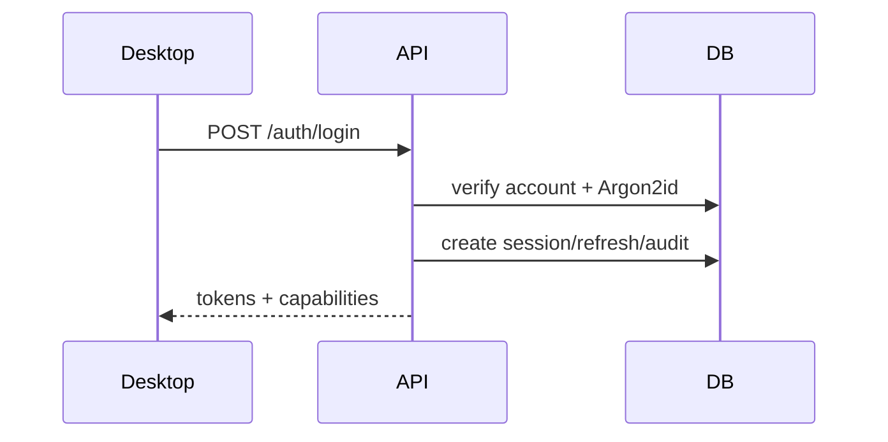

**Шаги и контроль:** Desktop->API: POST /auth/login; API->DB: verify account + Argon2id; API->DB: create session/refresh/audit; API-->Desktop: tokens + capabilities. Ошибка на любом шаге до commit не публикует domain event; после commit повторная доставка идемпотентна.

## 31.2. Продление сессии

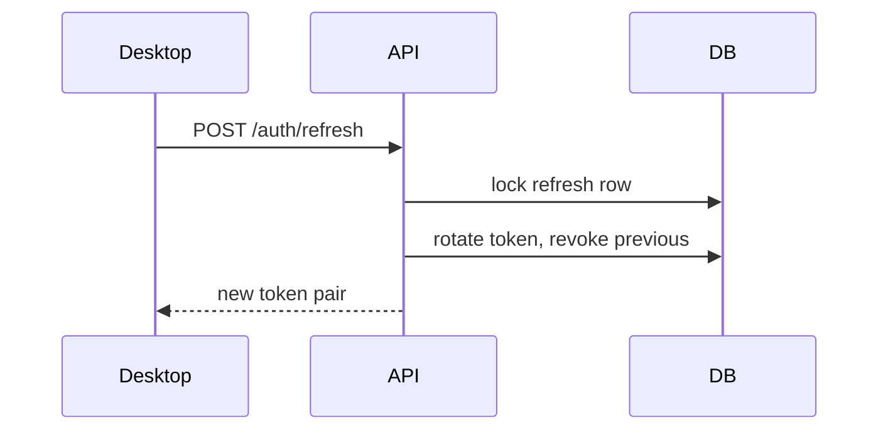

**Шаги и контроль:** Desktop->API: POST /auth/refresh; API->DB: lock refresh row; API->DB: rotate token, revoke previous; API-->Desktop: new token pair. Ошибка на любом шаге до commit не публикует domain event; после commit повторная доставка идемпотентна.

## 31.3. Создание задачи

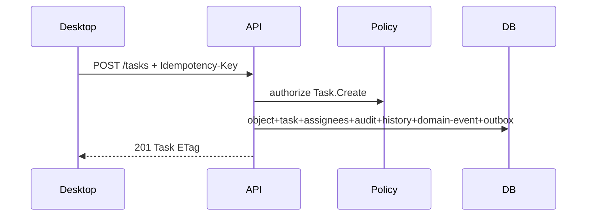

**Шаги и контроль:** Desktop->API: POST /tasks + Idempotency-Key; API->Policy: authorize Task.Create; API->DB: object+task+assignees+audit+history+domain-event+outbox; API-->Desktop: 201 Task ETag. Change feed заполняет projector после commit. Ошибка на любом шаге до commit не публикует domain event; после commit повторная доставка идемпотентна.

## 31.4. Назначение исполнителя

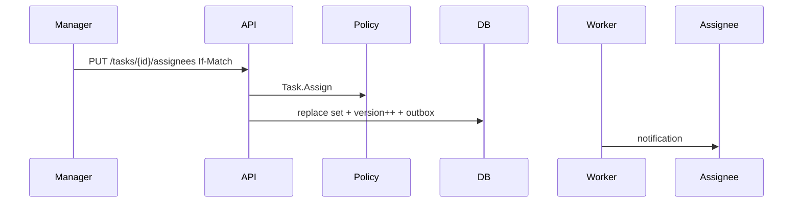

**Шаги и контроль:** Manager->API: PUT /tasks/{id}/assignees If-Match; API->Policy: Task.Assign; API->DB: replace set + version++ + outbox; Worker->Assignee: notification. Ошибка на любом шаге до commit не публикует domain event; после commit повторная доставка идемпотентна.

## 31.5. Изменение статуса

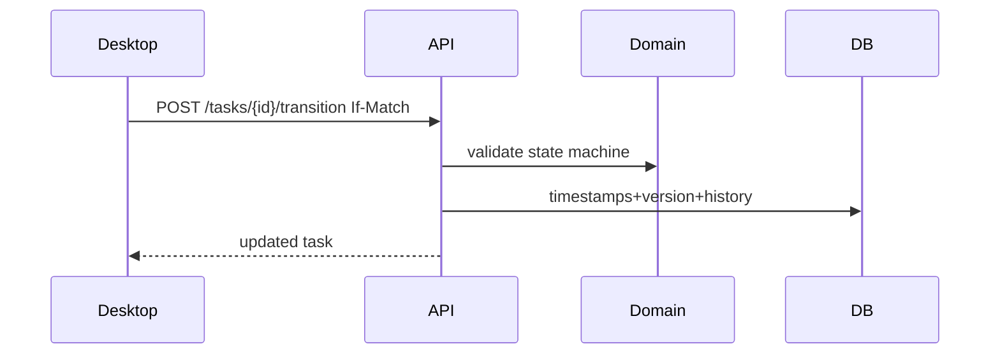

**Шаги и контроль:** Desktop->API: POST /tasks/{id}/transition If-Match; API->Domain: validate state machine; API->DB: timestamps+version+history; API-->Desktop: updated task. Ошибка на любом шаге до commit не публикует domain event; после commit повторная доставка идемпотентна.

## 31.6. Одновременное редактирование

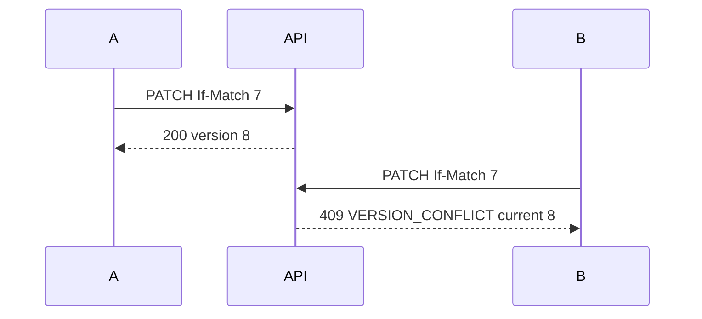

**Шаги и контроль:** A->API: PATCH If-Match 7; API-->A: 200 version 8; B->API: PATCH If-Match 7; API-->B: 409 VERSION_CONFLICT current 8. Ошибка на любом шаге до commit не публикует domain event; после commit повторная доставка идемпотентна.

## 31.7. Создание повторяющейся задачи

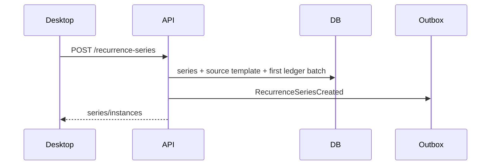

**Шаги и контроль:** Desktop->API: POST /recurrence-series; API->DB: series + source template + first ledger batch; API->Outbox: RecurrenceSeriesCreated; API-->Desktop: series/instances. Ошибка на любом шаге до commit не публикует domain event; после commit повторная доставка идемпотентна.

## 31.8. Генерация экземпляра серии

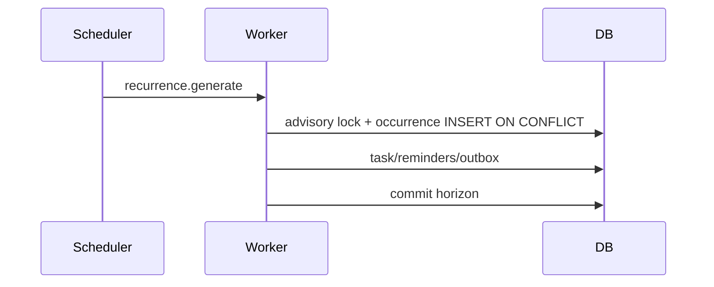

**Шаги и контроль:** Scheduler->Worker: recurrence.generate; Worker->DB: advisory lock + occurrence INSERT ON CONFLICT; Worker->DB: task/reminders/outbox; Worker->DB: commit horizon. Ошибка на любом шаге до commit не публикует domain event; после commit повторная доставка идемпотентна.

## 31.9. Создание напоминания

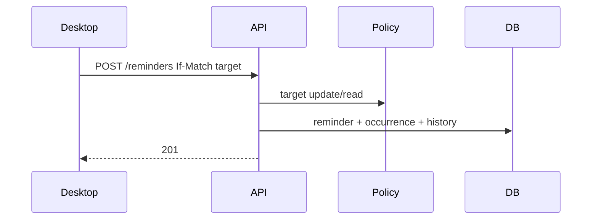

**Шаги и контроль:** Desktop->API: POST /reminders If-Match target; API->Policy: target update/read; API->DB: reminder + occurrence + history; API-->Desktop: 201. Ошибка на любом шаге до commit не публикует domain event; после commit повторная доставка идемпотентна.

## 31.10. Получение desktop-уведомления

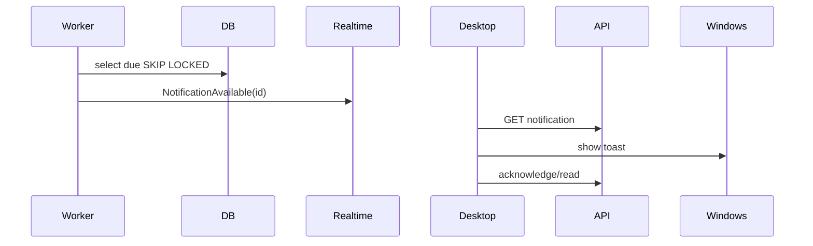

**Шаги и контроль:** Worker->DB: select due SKIP LOCKED; Worker->Realtime: NotificationAvailable(id); Desktop->API: GET notification; Desktop->Windows: show toast; Desktop->API: acknowledge/read. Ошибка на любом шаге до commit не публикует domain event; после commit повторная доставка идемпотентна.

## 31.11. Добавление комментария

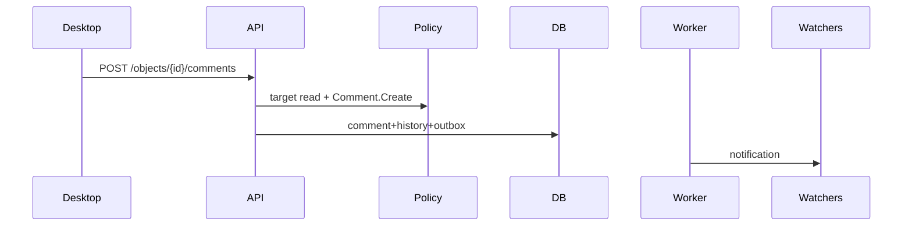

**Шаги и контроль:** Desktop->API: POST /objects/{id}/comments; API->Policy: target read + Comment.Create; API->DB: comment+history+outbox; Worker->Watchers: notification. Ошибка на любом шаге до commit не публикует domain event; после commit повторная доставка идемпотентна.

## 31.12. Создание проекта

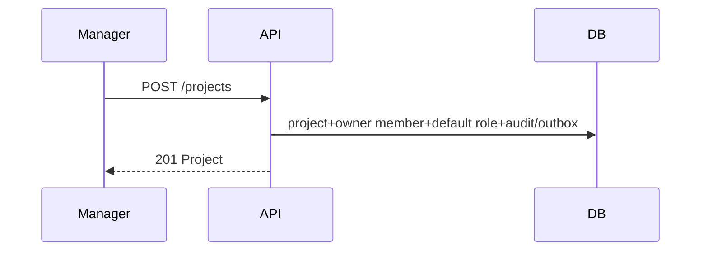

**Шаги и контроль:** Manager->API: POST /projects; API->DB: project+owner member+default role+audit/outbox; API-->Manager: 201 Project. Ошибка на любом шаге до commit не публикует domain event; после commit повторная доставка идемпотентна.

## 31.13. Добавление участника

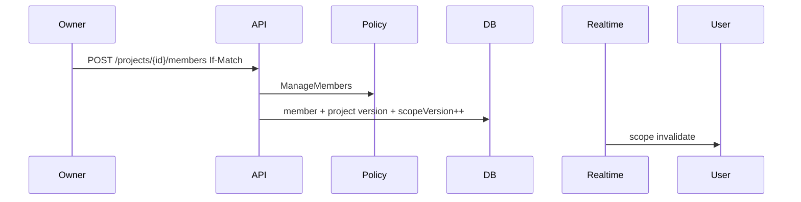

**Шаги и контроль:** Owner->API: POST /projects/{id}/members If-Match; API->Policy: ManageMembers; API->DB: member + project version + scopeVersion++; Realtime->User: scope invalidate. Ошибка на любом шаге до commit не публикует domain event; после commit повторная доставка идемпотентна.

## 31.14. Добавление ссылки на файл

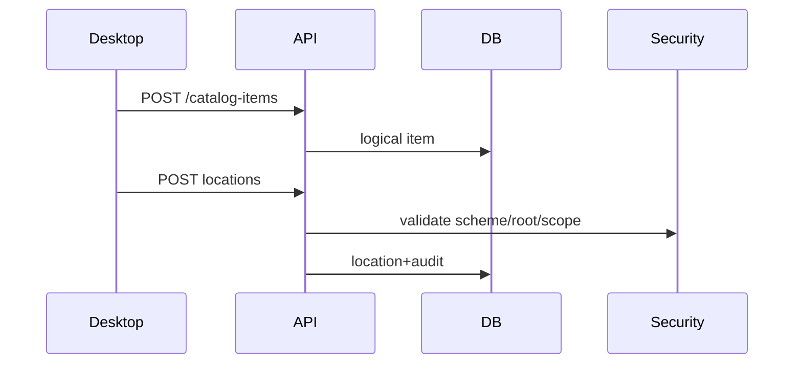

**Шаги и контроль:** Desktop->API: POST /catalog-items; API->DB: logical item; Desktop->API: POST locations; API->Security: validate scheme/root/scope; API->DB: location+audit. Ошибка на любом шаге до commit не публикует domain event; после commit повторная доставка идемпотентна.

## 31.15. Открытие сетевого файла

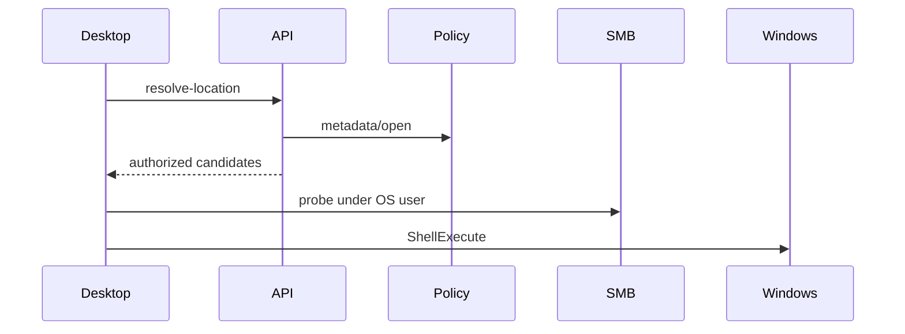

**Шаги и контроль:** Desktop->API: resolve-location; API->Policy: metadata/open; API-->Desktop: authorized candidates; Desktop->SMB: probe under OS user; Desktop->Windows: ShellExecute. Ошибка на любом шаге до commit не публикует domain event; после commit повторная доставка идемпотентна.

## 31.16. Файл недоступен

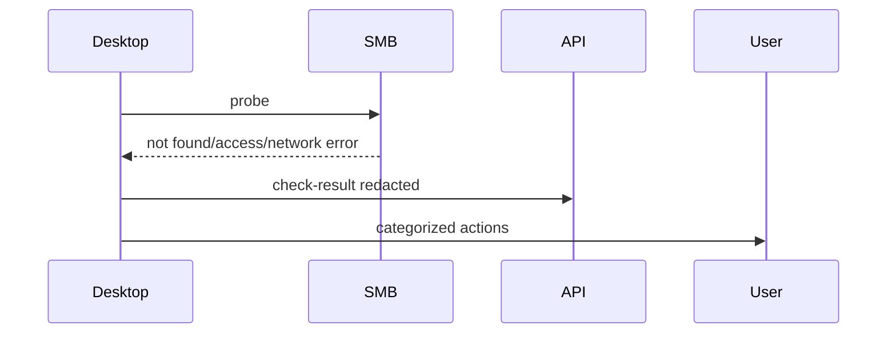

**Шаги и контроль:** Desktop->SMB: probe; SMB-->Desktop: not found/access/network error; Desktop->API: check-result redacted; Desktop->User: categorized actions. Ошибка на любом шаге до commit не публикует domain event; после commit повторная доставка идемпотентна.

## 31.17. Перепривязка файла

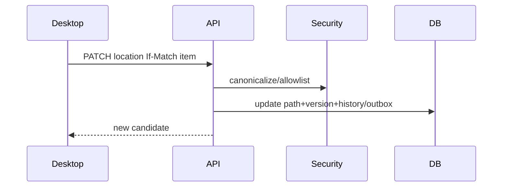

**Шаги и контроль:** Desktop->API: PATCH location If-Match item; API->Security: canonicalize/allowlist; API->DB: update path+version+history/outbox; API-->Desktop: new candidate. Ошибка на любом шаге до commit не публикует domain event; после commit повторная доставка идемпотентна.

## 31.18. Потеря связи с сервером

```mermaid
sequenceDiagram
  Desktop->>API: request timeout
  Desktop->>Sync: mark offline
  Desktop->>Cache: read-only projections
  Desktop->>User: writes disabled; local files remain
```

**Шаги и контроль:** Desktop->API: request timeout; Desktop->Sync: mark offline; Desktop->Cache: read-only projections; Desktop->User: writes disabled; local files remain. Ошибка на любом шаге до commit не публикует domain event; после commit повторная доставка идемпотентна.

## 31.19. Восстановление связи

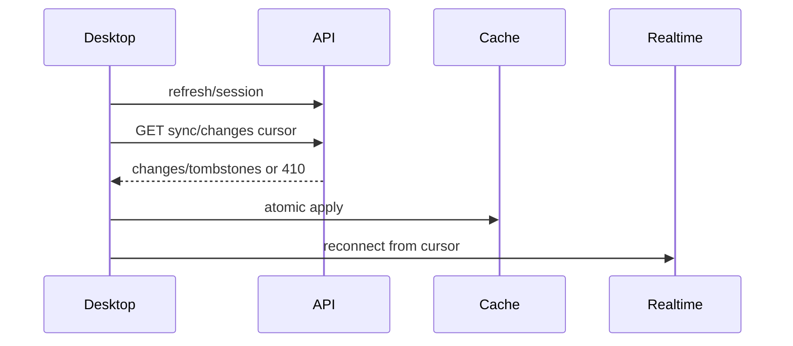

**Шаги и контроль:** Desktop->API: refresh/session; Desktop->API: GET sync/changes cursor; API-->Desktop: changes/tombstones or 410; Desktop->Cache: atomic apply; Desktop->Realtime: reconnect from cursor. Ошибка на любом шаге до commit не публикует domain event; после commit повторная доставка идемпотентна.

## 31.20. Удаление объекта

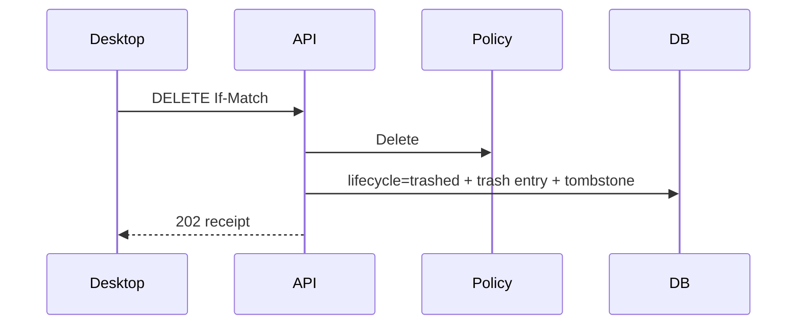

**Шаги и контроль:** Desktop->API: DELETE If-Match; API->Policy: Delete; API->DB: lifecycle=trashed + trash entry + tombstone; API-->Desktop: 202 receipt. Ошибка на любом шаге до commit не публикует domain event; после commit повторная доставка идемпотентна.

## 31.21. Восстановление из корзины

```mermaid
sequenceDiagram
  Desktop->>API: POST trash/{id}/restore
  API->>Domain: validate parent/name/rights
  API->>DB: active + version + reindex/outbox
  API-->>Desktop: object
```

**Шаги и контроль:** Desktop->API: POST trash/{id}/restore; API->Domain: validate parent/name/rights; API->DB: active + version + reindex/outbox; API-->Desktop: object. Ошибка на любом шаге до commit не публикует domain event; после commit повторная доставка идемпотентна.

## 31.22. Блокировка пользователя

```mermaid
sequenceDiagram
  Admin->>API: POST users/{id}/block If-Match
  API->>DB: account blocked + revoke sessions + scopeVersion++
  Realtime->>Devices: session revoked
  Devices->>Cache: purge on next contact
```

**Шаги и контроль:** Admin->API: POST users/{id}/block If-Match; API->DB: account blocked + revoke sessions + scopeVersion++; Realtime->Devices: session revoked; Devices->Cache: purge on next contact. Ошибка на любом шаге до commit не публикует domain event; после commit повторная доставка идемпотентна.

## 31.23. Изменение прав

```mermaid
sequenceDiagram
  Admin->>API: PUT roles/members/rules
  API->>DB: authorization rows + scopeVersion++ + audit
  Outbox->>Realtime: AuthorizationScopeChanged
  Desktop->>Sync: purge/bootstrap
```

**Шаги и контроль:** Admin->API: PUT roles/members/rules; API->DB: authorization rows + scopeVersion++ + audit; Outbox->Realtime: AuthorizationScopeChanged; Desktop->Sync: purge/bootstrap. Ошибка на любом шаге до commit не публикует domain event; после commit повторная доставка идемпотентна.

## 31.24. Глобальный поиск

```mermaid
sequenceDiagram
  Desktop->>API: GET /search?q=...
  API->>Policy: build authorized scope
  API->>DB: FTS/trgm + scope joins + cursor
  API-->>Desktop: grouped results
```

**Шаги и контроль:** Desktop->API: GET /search?q=...; API->Policy: build authorized scope; API->DB: FTS/trgm + scope joins + cursor; API-->Desktop: grouped results. Ошибка на любом шаге до commit не публикует domain event; после commit повторная доставка идемпотентна.

## 31.25. Резервное копирование и восстановление

```mermaid
sequenceDiagram
  Scheduler->>BackupAgent: base backup/WAL
  BackupAgent->>Repository: encrypted artifacts+manifest
  Verifier->>IsolatedDB: restore+checks
  Verifier->>DB: backup_run verified
  Admin->>Plan: controlled restore in maintenance mode
```

**Шаги и контроль:** Scheduler->BackupAgent: base backup/WAL; BackupAgent->Repository: encrypted artifacts+manifest; Verifier->IsolatedDB: restore+checks; Verifier->DB: backup_run verified; Admin->Plan: controlled restore in maintenance mode. Ошибка на любом шаге до commit не публикует domain event; после commit повторная доставка идемпотентна.


# 32. Безопасность данных и API

Backend checklist:
- Argon2id, token hashing, rotation/reuse detection, server session lookup for sensitive commands.
- TLS 1.2+, internal CA, certificate pinning optional with managed rotation; DB TLS and least-privilege roles.
- Parameterized SQL only; DTO allowlists; no entity mass binding; object authorization after load and in query predicate.
- Path canonicalization, scheme/root allowlist, no credentials, no server-side file open, no arbitrary shell.
- Structured logs with redaction; PII access/audit; encrypted backup and separated key material.
- Rate limits, request size, timeout, cancellation, health endpoints network-restricted.

Desktop checklist:
- Refresh token only Credential Manager/DPAPI; access token memory-only; encrypted per-user cache.
- Clear cache on logout/revocation/scope change; no offline writes.
- Validate server certificate; never bypass TLS errors silently.
- File open only through File Access Adapter; display selected path; risky extension confirmation/policy.
- Prevent command injection: Windows Shell API with path argument, no `cmd.exe /c` concatenation.
- Toast actions re-authorize target command server-side; payload is opaque ID, not trusted state.

# 33. Производительность

| Query | Частота/объём | Индексы/shape | Limit/cache/risk |
| --- | --- | --- | --- |
| Сегодня | каждый старт/refresh; ≤500 visible | assignee + scheduled date + open deadline; two set queries | 500; client cache; avoid OR mega-query |
| Month calendar | interactive; ≤10k items scoped | date/start indexes + assignee/event attendee | range 62 days; summary DTO |
| Project tasks | frequent; up to 100k/project | project,status,date,id cursor | page 100; no count by default |
| Search | burst; millions docs | GIN FTS + trigram + auth scope | 100; query timeout 3s |
| History | on demand; large append-only | object_id,version desc | cursor 100; partitions |
| Notifications | frequent; per user | recipient,status,not_before | top 100; unread count cached short |
| Catalog tree | frequent; up to 1m nodes | parent,sort,name | lazy children; no full recursive load |
| Permissions | every command/query | precomputed role sets + scopeVersion | cache 1–5 min keyed by scopeVersion |

Target p95 inside LAN: ordinary reads <300 ms, writes <500 ms excluding password hash, search <800 ms, notification server-to-connected-client <5 s. Query plans are captured in integration performance tests with representative scale.

# 34. Тестируемость

- Unit/domain: state machines, time/DST, path ranking, recurrence scopes, permission precedence.
- DB: every constraint/index/migration; pgTAP or integration PostgreSQL container, no in-memory substitute.
- Contract: OpenAPI request/response/error and ETag/idempotency headers.
- Authorization: table-driven positive/negative/BOLA tests for every endpoint and role/relation combination.
- Concurrency: stale version, duplicate idempotency, recurrence double worker, SKIP LOCKED, ownership transfer race.
- Integration: full transaction includes state+history+domain-event+outbox; rollback leaves none; projector idempotently creates one feed row per source event/object/operation.
- Failure: DB unavailable, storage full, expired cursor, WebSocket loss, SMB timeout/access denied, worker retry/DLQ.
- Restore: weekly automated restore verification plus quarterly timed exercise.
- Security: SAST/dependency scan, secret scan, TLS config, injection/mass assignment/path traversal, token reuse.

Definition of done для endpoint: contract test, permission test, domain test, DB integration test, conflict/idempotency test, audit/event assertion, telemetry and error mapping.
