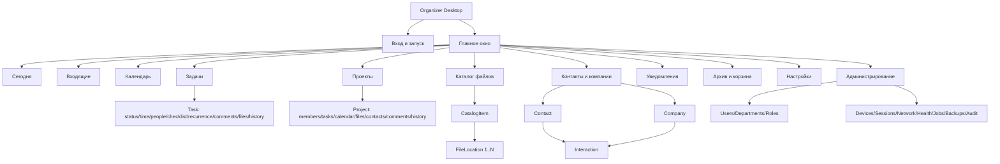

# Stage 3. UX Architecture

**Статус:** UX-спецификация Этапа 3.1 для PRD, wireframes, UI-kit, Figma, acceptance criteria и desktop backlog.

## Нормативная база и границы проверки

Этап 3.1 использует результат Этапа 3.0 и не повторяет полный аудит упаковки. Приоритет источников:

1. `architecture_organizer.md` — финальная концепция и бизнес-состав.
2. `01_core_domain_and_data.md` — ограничения Этапа 1: Windows/WPF, server-authoritative, online-only writes, read-only cache, metadata-only files, OS/SMB ACL, optimistic locking.
3. `06_stage_2_1_normative_corrections.md` — данные, lifecycle, права, recurrence, time model, file locations.
4. `traceability.csv`, `00_MANIFEST.md`, `STAGE_3_SOURCE_INDEX.md`, `02_api_and_concurrency.md` — API, permissions, ошибки, события, sync и сценарии.
5. `Старт UX архитектуры.txt` — решения и идентификаторы Этапа 3.0.

Этап 3.4 использует нормативный OpenAPI 3.1 `1.2.0-stage2.2` (241 операций, 232 schemas, 1322 DTO fields), `dto_field_catalog.csv`, `Search_Contract.md`, catalogs permissions/errors и validation/codegen reports. Field-level проверка завершена; нормативная трассировка находится в `Stage_3_Field_Traceability.csv`.

## Подтверждение изученных источников

Использованы финальная концепция, архитектура Этапа 1, нормативные коррекции 2.1, API/permission/error/event каталоги, traceability из 241 операции и сохранённый результат Этапа 3.0. Повторный полный аудит не выполнялся. Принятые в Этапе 3.0 решения сохранены: capability-driven UI, раздельные lifecycle, read-only при недоступности сервера и стабильные UX ID.

## Полное оглавление

1. Executive UX Summary
2. Пользователи и рабочие контексты
3. UX-принципы продукта
4. Информационная архитектура
5. App Shell
6. Модель навигации
7. Реестр экранов
8. Сегодня
9. Входящие
10. Задачи
11. Календарь
12. Проекты
13. Каталог файлов
14. Контакты и компании
15. Глобальный поиск
16. Уведомления и напоминания
17. Архив и корзина
18. Настройки
19. Администрирование
20. User Flows
21. Состояния интерфейса
22. Роли и интерфейс
23. Конфликтное редактирование
24. Потеря сервера и синхронизация
25. Desktop Interaction Model
26. Accessibility
27. UX-копирайтинг
28. API и UX Traceability
29. Требования к будущим wireframes
30. Критерии готовности Этапа 3
31. Независимая самопроверка

---

## 1. Executive UX Summary

### 1.1. Основная UX-концепция

Organizer является desktop work hub: пользователь выбирает рабочий объект, видит его контекст и выполняет узкую следующую команду без перехода через набор несвязанных CRUD-форм. Основной pattern — navigation rail + list/tree/calendar canvas + persistent details inspector + full card для сложного редактирования.

### 1.2. Ключевая модель взаимодействия

| Уровень | Роль в UX | Правило |
| --- | --- | --- |
| Shell | Глобальная ориентация, поиск, quick create, connection/sync | Постоянен во всех рабочих разделах |
| Collection surface | Today/list/tree/calendar/search | Оптимизирован для scan, selection и narrow commands |
| Inspector | Контекст выбранного объекта | Не заменяет full editor; сохраняет list context |
| Full card/editor | Сложная работа с агрегатом | Explicit save и optimistic conflict flow |
| Dialog/popover | Короткое ограниченное решение | Не превращается в отдельную навигационную ветку |
| Windows surface | Toast, tray, picker, Shell open | Business action всегда перепроверяется сервером |

### 1.3. Основные рабочие объекты

- Task и один уровень subtask
- CalendarEvent и объединённая ScheduleItem projection
- Project и ProjectMember
- InboxItem
- CatalogItem и FileLocation 1..N
- Contact, Company и Interaction
- Reminder и Notification
- UserAccount, EmployeeProfile, Department, Role/Permission
- ArchiveEntry, TrashEntry, ObjectHistory и AuditEntry

### 1.4. Основные пользовательские циклы

- Capture → classify → plan → execute → review/complete → archive if needed.
- Create project → add members → plan tasks/calendar → collaborate → complete → archive.
- Find CatalogItem → resolve current-device path → diagnose/open → relink/add alternate path.
- Receive notification → open/complete/snooze/reschedule → server confirms current state.
- Lose connection → read cached data → keep route → reconnect → sync/invalidate → resume.

### 1.5. Главные ограничения

- Server is the only source of truth; business writes require a live server.
- Local cache is encrypted, disposable and read-only during outage.
- Working file bytes are outside the application; Windows/SMB ACL remains authoritative.
- No silent last-write-wins; every versioned mutation can produce a conflict.
- UI cannot infer authorization from role labels; server capabilities and object relations decide.
- One main application window in MVP; no web/mobile metaphors or arbitrary admin shell.

### 1.6. Ключевые UX-риски и решения

| Риск | Решение |
| --- | --- |
| Смешение start/deadline/reminder | Раздельная time model и подписи на всех surfaces |
| Ложное обещание доступа к файлу | Разделить metadata permission и OS access diagnostics |
| Потеря изменений при concurrency | Explicit save, version compare, conflict resolver |
| Скрытая устаревшая информация при изменении прав | Scope purge before render and bootstrap |
| Перегруженный desktop интерфейс | Progressive disclosure, inspector, lazy tabs, virtualization |
| Недоступность действий с клавиатуры | Unified command registry and drag alternatives |
| Опасное удаление | Completion/archive/trash/purge separated; never delete physical file |

## 2. Пользователи и рабочие контексты

| Роль | Цели | Ежедневные/частые действия | Редкие действия | Критические сценарии | Уровень доступа | Ограничения | Потенциальные ошибки | Shortcuts |
| --- | --- | --- | --- | --- | --- | --- | --- | --- |
| Администратор системы | Доступность, пользователи, права и инфраструктура | Пользователи, отделы, роли, устройства, sessions, network resources, health, backup, audit | Restore plan, feature flags, purge, audit export | Storage full, failed backup, compromised session | Глобальные admin capabilities с аудитом; бизнес-объекты — только по policy | Не обходит OS ACL, не видит пароли, не получает shell/SQL | Self-lockout, чрезмерная роль, опасный purge | Ctrl+K; Ctrl+Shift+F; F6; Alt+Left/Right |
| Руководитель | Планировать и контролировать работу в scope | Проекты, участники, задачи, календарь сотрудников, review и сроки | Project role/ownership, project archive | Просрочка, конфликт назначения, потеря доступа участника | Department/project/object scoped | Не имеет автоматического доступа ко всей компании | Назначение вне scope, неверная серия recurrence | Ctrl+N; Ctrl+K; Ctrl+Enter; Alt+1…8 |
| Сотрудник | Выполнять назначенную работу | Today, Inbox, свои/назначенные задачи, comments, files, contacts | Recurrence, relink, restore | Недоступный файл, conflict, read-only outage | Own/assigned/project/department relations | Не управляет системными ролями и скрытыми проектами | Смешение deadline/start/reminder, local path as global | Ctrl+N; Ctrl+Shift+N; Space; F2 |
| Наблюдатель | Получать актуальную картину без изменения | Просмотр проектов, задач, файлов, комментариев и истории | Открытие разрешённого файла, поиск | Access revoked, file unavailable, partial access | Read-only relations; FileReference.Open отдельно | Нет редактирования; metadata не гарантирует OS access | Ожидание доступности из-за видимой кнопки | Ctrl+K; Ctrl+Shift+F; F6; Enter |

### 2.1. Контекстные различия

- Системная роль задаёт базовый scope, но project role, department relation, ownership, assignee/watch relation и explicit deny изменяют итоговую capability.
- Observer не является “урезанным Employee”: интерфейс строится как полноценный read-only workflow с search, links, history and file open where allowed.
- Admin business access не считается абсолютным: administrative permissions and object permissions remain separate, while audit access is explicit.

## 3. UX-принципы продукта

| ID | Принцип | Обоснование | Пример | Антипример |
| --- | --- | --- | --- | --- |
| UXP-01 | Сервер подтверждает изменение | Общие данные меняются только после успешного ответа сервера. | Статус строки окончательно меняется после подтверждения и новой версии. | Локально ставить команду в очередь при отсутствии сервера. |
| UXP-02 | Capability-driven, не role-name-driven | Действия определяются server capabilities и object relations. | `Task.Assign` включает назначение только в разрешённом scope. | Считать любого Manager способным менять любую задачу. |
| UXP-03 | Рабочий контекст важнее CRUD | Путь строится вокруг выполнения работы и связей объектов. | Из Today открыть файл, завершить задачу и перейти к контакту. | Для каждой операции открывать отдельную CRUD-форму. |
| UXP-04 | Временные понятия разделены | Дата, старт, длительность, deadline, reminder и completed_at независимы. | Date-only задача находится в «Без времени», deadline показан отдельно. | Одно поле «Срок» для всех временных смыслов. |
| UXP-05 | Completion, archive и trash не смешиваются | Бизнес-статус и системный lifecycle отображаются отдельно. | Выполненная задача остаётся активной до отдельного архивирования. | Автоматически отправлять выполненное в архив/корзину. |
| UXP-06 | Сложные состояния видимы | Offline, stale, partial access, conflict и unavailable имеют разные UI-состояния. | Read-only banner содержит время последней синхронизации. | Одинаковое «Что-то пошло не так» для всех отказов. |
| UXP-07 | Плотность с управляемой детализацией | Desktop использует list/tree/detail и lazy tabs. | Частые поля видны в строке, recurrence и history раскрываются по требованию. | Показывать все поля одной длинной формой. |
| UXP-08 | Клавиатура равноправна мыши | Частые действия имеют shortcuts и альтернативы drag-and-drop. | F6 переключает области; keyboard dialog заменяет drag/resize. | Требовать мышь для планирования. |
| UXP-09 | Безопасное действие по умолчанию | Необратимые действия объясняют последствия и проверяют permission. | Purge сообщает, что физический файл не удаляется. | Delete в каталоге означает удаление файла с диска. |
| UXP-10 | Метаданные не обещают OS-доступ | Видимость записи и Windows/SMB ACL разделены. | Not Found, Access Denied и Network unavailable различаются. | Считать UNC-путь доказательством открытия. |
| UXP-11 | Узкие команды уменьшают конфликты | Статус/checklist/snooze меняются отдельными командами; карточка сохраняется явно. | Checklist item не сохраняет весь task draft. | Автосохранять весь агрегат после каждого поля. |
| UXP-12 | Навигация сохраняет контекст | Back/deep links сохраняют фильтр, selection и scroll anchor. | Из CatalogItem перейти к задаче и вернуться к тому же узлу. | Сбрасывать раздел при каждом deep link. |
| UXP-13 | Ошибка содержит безопасное восстановление | Текст объясняет следующий шаг и не раскрывает скрытые объекты. | VERSION_CONFLICT предлагает сравнить и обновить. | Показывать stack trace или существование скрытого объекта. |
| UXP-14 | Производительность входит в UX | Диапазоны, виртуализация, lazy loading и background refresh обязательны. | Month загружает компактные карточки. | Загружать все задачи/историю/дерево до первого render. |

## 4. Информационная архитектура

### 4.1. Полное дерево приложения

```text
Organizer
├─ Запуск: Вход / Подключение / Bootstrap / Update / Session interruption
├─ Главное окно
│  ├─ Сегодня
│  ├─ Входящие
│  ├─ Календарь: День / Неделя / Месяц
│  ├─ Задачи: Список / Дерево / Карточка / Детали
│  ├─ Проекты: Обзор / Задачи / Календарь / Участники / Файлы / Контакты / Комментарии / История / Настройки
│  ├─ Каталог файлов: Дерево / Список / Детали / Locations / Связи / История
│  ├─ Контакты и компании: Карточки / Каналы / Взаимодействия / Связи
│  ├─ Уведомления
│  ├─ Архив
│  ├─ Корзина
│  ├─ Настройки: Профиль / Пароль / Notifications / Calendar / Startup+tray / Cache+sync / Connection / Accessibility / Diagnostics
│  └─ Администрирование [capability]: Users / Departments / Roles / Devices / Sessions / Network / Health / Jobs / Backups / Audit
├─ Global: Search / Command palette / Quick create / Detail pane / Connection+sync / Conflict+error dialogs
└─ Windows: Tray / Toast / Native picker / Shell open
```

### 4.2. Карта связей



### 4.3. Уровни навигации

| Уровень | Содержание | Пример |
| --- | --- | --- |
| L0 | Startup/session/system gate | Login, server unavailable, update required |
| L1 | Primary global sections | Today, Inbox, Calendar, Tasks, Projects, Catalog, Contacts |
| L2 | Module views and scopes | Task list/tree; Calendar day/week/month; Project tabs |
| L3 | Selected object context | Inspector or full card |
| L4 | Focused command surface | Editor, recurrence scope, relink, conflict, confirmation |

### 4.4. Служебные и административные области

Connection/sync, notifications, profile, command palette and detail inspector are global services. Administration is a separate primary section shown only when at least one admin capability exists; inaccessible subsections are not shown.

### 4.5. Breadcrumbs, deep links и Back

- Breadcrumbs represent hierarchy/context, not browser URL segments: `Проекты / Альфа / Задачи / Подготовить договор`.
- Catalog uses virtual-tree breadcrumbs; Project/Contact links are semantic breadcrumbs, not physical parents.
- Deep-link scheme: `organizer://{objectType}/{id}` with optional safe view parameters; the app reauthorizes before rendering.
- Back restores previous route, filter, selection and scroll anchor, then refreshes data; it never restores unauthorized snapshots.
- Alt+Left/Right navigate local history. Closing a dialog returns focus to the invoking control.

## 5. App Shell

### 5.1. Постоянные области

| Область | Состав | Обоснование |
| --- | --- | --- |
| Window chrome/title | App name, current context, native minimize/maximize/close | Windows expectation and multi-monitor management |
| Left navigation | Primary modules, unread counts, Admin when available | Stable muscle memory; compact/collapsed mode |
| Top command area | Back/forward, breadcrumb, search, quick create, contextual command bar | Frequent global actions without menu hunting |
| Workspace | List/tree/calendar/page | Primary task-specific canvas |
| Details pane | Selected object summary and narrow commands | Keeps collection context and reduces modal navigation |
| Status strip | Server, sync, stale timestamp, background operation | Makes technical truth visible without blocking work |
| Profile/notification entry | Current user, notification center, settings/logout | Security/session access remains globally available |

### 5.2. Главное окно и размеры

- Default three-region layout: navigation 220–280 px, workspace flexible, details 360–480 px. Exact pixels are design-stage decisions, not normative here.
- Below approximately 1100 logical px, details becomes overlay/drawer and navigation collapses to icons; no horizontal compression that hides status or primary command.
- Minimum window size must support 200% scale without clipped primary actions. Window state is device-local and restored only onto a visible monitor.
- MVP uses one main window. Deep links focus an existing object/editor instance; modal dialogs are owned by the main window.

### 5.3. Search, quick actions, notifications and tray

- Ctrl+Shift+F opens global search; Ctrl+K opens command palette; Ctrl+N creates a task; Ctrl+Shift+N opens Inbox capture.
- Connection icon shows state and opens diagnostics; sync icon shows last successful time and active phase.
- Tray menu: Open Organizer, Quick Task, Inbox Capture, DND, connection summary, Exit. Closing the main window follows the configured tray behavior.
- Windows toast contains only authorized minimal context; every action rechecks session, permission, version and target state.

## 6. Модель навигации

| Mechanism | Use | Rules |
| --- | --- | --- |
| Primary navigation | L1 modules | Stable order; permission-hidden modules excluded |
| Secondary navigation | Module views/tabs/scopes | Preserves per-section state and last valid view |
| Contextual navigation | Inspector links, object relations, breadcrumbs | Opens in current shell and records Back history |
| Tabs | Project/card subcontexts | Lazy loaded; no separate browser-like tab system in MVP |
| Panels | Filters, details, diagnostics | Dismissable without losing route |
| Dialogs | Atomic decision/edit/confirm | Escape cancels when safe; Enter never triggers destructive default |
| Context menus | Selection-specific commands | Same command registry as toolbar/palette; Shift+F10 |
| Command palette | Cross-module commands and navigation | Capability and state filtered |
| Keyboard navigation | F6, Tab/Shift+Tab, arrows, Enter, Escape | Logical focus groups and visible focus |
| Deep links/history | Object links, notifications, search | Reauthorize; restore route context; no stale snapshot |

### 6.1. Сохранение состояния раздела

Filter, sort, grouping, view mode, selected scope, scroll anchor and inspector width are stored device-locally per user. Sensitive object payload is not stored in navigation history. Invalid filters are removed after permission/schema changes with a visible notice.

## 7. Реестр экранов

Полный реестр из **128** surfaces находится в `Stage_3_Screen_Catalog.md`. Он включает pages, views, tabs, panels, dialogs, context menus, tray, system notifications and native Windows integration.

## 8. Сегодня

### 8.1. Назначение

Главный рабочий экран с минимальным временем до следующего действия.

### 8.2. Состав и приоритет

Просроченные; attention/review/waiting; timeline; date-only; ближайшие события; reminders.

### 8.3. Действия

Open, transition, complete, move, assign при capability, snooze/dismiss, drag date-only на timeline.

### 8.4. Ролевые различия

Manager может менять разрешённый employee/department scope; Observer read-only.

### 8.5. Состояния и ошибки

Section loading/error, empty, stale, offline read-only, partial access.

### 8.6. Данные/API

GET /api/v1/today + task/reminder commands.

### 8.7. Производительность

Один агрегированный read model, лимитированные секции, virtualized timeline.

## 9. Входящие
### 9.1. Назначение

Быстрый личный захват до классификации.

### 9.2. Состав и приоритет

Capture field; необработанные items; preview; batch selection.

### 9.3. Действия

Create text/idea/URL/file draft; convert to Task/CatalogItem; set project/date; trash.

### 9.4. Ролевые различия

Own scope; раздел скрыт без Inbox permissions.

### 9.5. Состояния и ошибки

Empty, invalid URL/path, conversion conflict, offline read-only.

### 9.6. Данные/API

Inbox endpoints и convert operations.

### 9.7. Производительность

Cursor paging, focus remains in capture, batch ≤100.

## 10. Задачи
### 10.1. Назначение

Планирование и выполнение Task без длинной CRUD-формы.

### 10.2. Состав и приоритет

List/tree, filter bar, inspector, full card; tabs Checklist/Subtasks/Comments/Files/Contacts/History.

### 10.3. Действия

Create/update/transition/assign/watch/move/reminder/recurrence/archive/trash/restore/bulk.

### 10.4. Ролевые различия

Field-level capabilities по relation и scope.

### 10.5. Состояния и ошибки

Conflict, archived, trashed, invalid transition, depth/cycle, partial links.

### 10.6. Данные/API

Tasks/checklists/recurrence/reminders/comments/links/history.

### 10.7. Производительность

Virtualized list, lazy tabs, explicit full save, narrow immediate commands.

### 10.8. Однозначная временная модель задачи

| Понятие | Поле/смысл | Отображение | Не означает |
| --- | --- | --- | --- |
| Дата | scheduled_date | День, в котором задача планируется; без времени попадает в отдельную lane | Deadline или старт в 00:00 |
| Время начала | start time + timezone → start_at_utc | Точная позиция на timeline | Дата завершения или reminder |
| Длительность | planned_duration_minutes | Размер блока и плановая занятость | Фактически затраченное время |
| Deadline | deadline_at | Последний допустимый момент; отдельный badge/field | Позиция на timeline |
| Reminder | Reminder trigger | Когда и кому доставить уведомление | Изменение task schedule при snooze |
| Фактическое завершение | completed_at | Server timestamp перехода в completed | Плановое окончание или deadline |

### 10.9. Drag-and-drop и массовые действия

- Drag within task tree/list changes explicit supported ordering/parent only; one-level subtask invariant remains server-validated.
- Calendar drag sends `move`/update with If-Match; visual preview rolls back on failure.
- Multi-select shows only commands valid for the selection class. Bulk transition returns per-item results; no silent partial success.
- Ctrl+A selects visible/loaded items by default. “All filtered” requires an explicit server-supported bulk scope.

## 11. Календарь
### 11.1. Назначение

Schedule projection Task + CalendarEvent.

### 11.2. Состав и приоритет

Range header, day/week/month, date-only row, employee filters, overlap, details.

### 11.3. Действия

Create, move, resize, filter, hide completed, keyboard reschedule.

### 11.4. Ролевые различия

Calendar.Read + target update capability and employee scope.

### 11.5. Состояния и ошибки

Range too large, overlap warning, drag conflict, timezone, cached range.

### 11.6. Данные/API

GET /calendar; CalendarEvent CRUD; task move.

### 11.7. Производительность

Day ≤2d, week ≤14d, month ≤62d; compact month cards.

## 12. Проекты
### 12.1. Назначение

Контекст участников, задач, календаря, файлов и контактов.

### 12.2. Состав и приоритет

Overview + Tasks/Calendar/Members/Files/Contacts/Comments/History/Settings.

### 12.3. Действия

Create/update/member roles/ownership/status/archive/trash/restore.

### 12.4. Ролевые различия

Project roles Owner/Manager/Editor/Executor/Observer plus server capabilities.

### 12.5. Состояния и ошибки

Owner invariant, duplicate member, scope change, completed vs archived, restore conflict.

### 12.6. Данные/API

Projects/members/overrides/history + related module queries.

### 12.7. Производительность

Lazy tabs; membership changes invalidate capabilities.
## 13. Каталог файлов

### 13.1. Назначение

Виртуальная организация внешних файлов без bytes.

### 13.2. Состав

Lazy tree, children list, item details, locations, availability, links/tags/history.

### 13.3. Действия

Create folder/reference/URL/note; move metadata; add/relink location; resolve/open; archive/trash.

### 13.4. Роли и permissions

Metadata read, FileReference.Open и FileLocation.Update разделены; local path visibility ограничена.

### 13.5. Состояния

No location, Not Found, Access Denied, Network unavailable, unsafe path/type.

### 13.6. Данные/API

Catalog/items/tree/locations/resolve/check/network resources.

### 13.7. Реализация/производительность

No recursive scan, async 2s probe, location ranking on desktop.

### 13.8. Типы элементов и виртуальное дерево

| Тип | Содержимое | Open behavior |
| --- | --- | --- |
| virtual_folder | Только логическая структура | Открывает children, не Windows folder |
| file_reference | Метаданные файла + FileLocation 1..N | Resolve → probe → Windows Shell open |
| folder_reference | Ссылка на физическую папку | Resolve → probe → Windows Explorer |
| web_link | Разрешённый URL | Validate scheme → default browser |
| text_note | Короткая текстовая заметка | Internal read/edit surface |

### 13.9. Алгоритм выбора пути

1. Server returns only allowed metadata and locations.
2. Client filters by current device/resource visibility and safe scheme.
3. Rank: current-device local location → available allowed network location → other eligible location by priority.
4. Show chosen location class, owner/device and last check; permit explicit alternative choice.
5. Probe asynchronously with bounded timeout and distinguish Not Found, Access Denied and Network unavailable.
6. After success invoke Windows Shell; application never streams or edits file bytes.

### 13.10. Ошибки и восстановление

| Diagnosis | UI message | Allowed recovery |
| --- | --- | --- |
| FILE_NO_LOCATION | Нет подходящего пути для этого устройства. | Add alternate path; request owner/admin action |
| FILE_NOT_FOUND | Файл не найден по выбранному пути. | Relink; choose alternate; keep record; open parent when possible |
| FILE_ACCESS_DENIED | Windows отказала в доступе. | Show owner/resource; contact administrator; choose alternate |
| NETWORK_RESOURCE_UNAVAILABLE | Сетевой ресурс недоступен. | Retry; diagnose network; choose local alternate |
| UNSAFE_PATH/UNSAFE_FILE_TYPE | Путь или тип заблокирован политикой. | Choose safe source; no override without policy |
| Foreign local path | Доступен только на устройстве владельца. | Show device/owner without revealing full sensitive path unless authorized |

### 13.11. Удаление и перемещение

- Drag inside virtual tree changes only CatalogItem parent and version.
- Relink changes one FileLocation; Add alternate keeps existing locations.
- Trash/purge removes metadata links only. No command, confirmation or hidden option deletes the physical file.
- Deleting a non-empty virtual folder requires a child-count/consequence confirmation and preserves physical files.

## 14. Контакты и компании

### 14.1. Назначение

Контекст контрагента и ручная interaction history, не CRM-воронка.

### 14.2. Состав

People/companies lists, cards, channels, relations, interactions, linked objects.

### 14.3. Действия

Create/update/archive/trash/restore; channels; relation; interaction; links.

### 14.4. Роли и permissions

Scoped read/update; Observer read-only.

### 14.5. Состояния

Duplicate warning, partial PII, hidden linked object, restore conflict.

### 14.6. Данные/API

Contacts/companies/interactions/links/history.

### 14.7. Реализация/производительность

Paged search; lazy linked tabs; no mail integration.

## 15. Глобальный поиск

### 15.1. Назначение

Найти разрешённый объект и открыть deep link.

### 15.2. Состав

Query, grouped results, filters, snippets, completeness banner.

### 15.3. Действия

Keyboard navigation, open, refine, type/date/project filters.

### 15.4. Роли и permissions

Server filters; no hidden-result counts; offline cache marked partial.

### 15.5. Состояния

Zero, partial, offline, stale result, target unavailable.

### 15.6. Данные/API

GET /search; /search/suggestions.

### 15.7. Реализация/производительность

Debounce 250–350ms, cancel previous request.

## 16. Уведомления и напоминания

### 16.1. Назначение

Доставить событие и выполнить ограниченное server-checked действие.

### 16.2. Состав

Notification center, Windows toast, unread, preferences/DND.

### 16.3. Действия

Open, complete, snooze, reschedule, dismiss, mark read.

### 16.4. Роли и permissions

Recipient-only; target permission/version/state rechecked.

### 16.5. Состояния

Target unavailable/forbidden/changed, DND, delivery failure, offline action blocked.

### 16.6. Данные/API

Notifications/reminders/preferences + target APIs.

### 16.7. Реализация/производительность

Reconcile after sleep/clock change; no toast guarantee when device off.

## 17. Архив и корзина

### 17.1. Назначение

Разделить read-only сохранение и reversible delete.

### 17.2. Состав

Archive by type; Trash with purge date/deleter/eligibility.

### 17.3. Действия

Unarchive, restore, purge after retention/legal hold.

### 17.4. Роли и permissions

Object-specific capabilities.

### 17.5. Состояния

Parent missing, name conflict, permission changed, legal hold, purged.

### 17.6. Данные/API

Archive/Trash + object-specific restore/unarchive.

### 17.7. Реализация/производительность

Cursor paging; physical files never deleted.

### 17.8. Матрица lifecycle

| Object/state | Completion | Archive | Trash | Restore | Purge/constraints |
| --- | --- | --- | --- | --- | --- |
| Task | completed/cancelled; reopen по permission | archive read-only | trash reversible | restore validates project/parent/uniqueness | purge metadata after retention/legal hold |
| Project | completed business status | archive excludes from active | trash does not cascade physical work | restore validates owner/name | purge never deletes files |
| CalendarEvent | no task workflow completion | archive supported | trash supported | restore/unarchive by capability | metadata purge |
| CatalogItem | no business completion | archive noncurrent metadata | trash virtual records | restore tree or choose parent | never delete physical file/folder |
| Contact/Company | active/inactive if exposed | archive noncurrent | trash supported | restore validates links/duplicates | PII purge by policy |
| InboxItem | converted terminal | no separate archive required | trash supported | own restore | purge by retention |
| Comment | no completion | no archive | delete=tombstone | restore author/moderator | versions/audit retained |
| UserAccount | active/blocked/deactivated | not generic archive | not generic trash | unblock/reactivate | identity/history retained |
| RecurrenceSeries | active/paused/completed/cancelled | no universal archive | DELETE=cancel, not trash | resume paused | ledger retained for idempotency |

### 17.9. Общие правила

- Completion is a business transition and does not remove the object from active lifecycle automatically.
- Archive is reversible, excludes the object from active defaults and is read-only until unarchive.
- Trash is logical deletion. Restore validates parent, uniqueness, project existence, role relations and current permissions.
- Purge is irreversible metadata deletion after retention/legal-hold checks. User accounts use deactivate/reactivate instead of generic delete.
- Catalog purge never deletes physical files or folders.

## 18. Настройки

### 18.1. Назначение

Только настройки с реальным effect и видимым scope.

### 18.2. Состав

Profile/password/notifications/calendar/startup/tray/cache/sync/connection/accessibility/diagnostics.

### 18.3. Действия

Update own settings, revoke session/device, clear cache, test connection.

### 18.4. Роли и permissions

User-synchronized/device-local/server-managed fields separated.

### 18.5. Состояния

Restart required, Windows permission denied, locked fields, cache rebuild.

### 18.6. Данные/API

Settings/notifications/auth/devices/sessions/capabilities/system.

### 18.7. Реализация/производительность

Save by section; clear cache triggers bootstrap.

## 19. Администрирование

### 19.1. Назначение

Ограниченное аудируемое управление без shell/DB console.

### 19.2. Состав

Users/departments/roles/devices/sessions/network/health/jobs/backups/audit.

### 19.3. Действия

Create/activate/block/deactivate; manage roles; revoke; run allowlisted jobs; backup/verify/restore plan.

### 19.4. Роли и permissions

Only explicit admin capabilities, mandatory audit for sensitive actions.

### 19.5. Состояния

Storage full, DB unavailable, backup failed, job running, forbidden.

### 19.6. Данные/API

Admin/users/departments/roles/devices/auth/network/health/audit.

### 19.7. Реализация/производительность

Paged operational tables; no hidden high-frequency polling.

## 20. User Flows

Каталог из **37** flows с основными и альтернативными путями находится в `Stage_3_User_Flows.md`. Ключевые цепочки: startup/session, task lifecycle, recurrence scopes, project membership, file resolve/relink, notifications, search, outage/reconnect, conflict, archive/trash/restore and administration.

## 21. Состояния интерфейса

Полная матрица находится в `Stage_3_State_Matrix.md`. Состояние задаётся на минимально полезной surface: failure одной Today-секции не блокирует другие; ошибка вкладки не закрывает карточку; stale/offline обозначается рядом с данными и в status strip.

### 21.1. Классы состояний

| Class | Examples | UI rule |
| --- | --- | --- |
| Data acquisition | Initial, Loading, Refreshing, Loaded | Skeleton only where structure known; retain usable data during refresh |
| Content | Empty, Filtered empty, Partial access | Explain whether data absent, filtered or hidden by rights |
| Authorization/lifecycle | Forbidden, Archived, Trashed, Scope changed | Hide/disable/write-lock according to reason |
| Connectivity/sync | Server unavailable, Read-only cache, Reconnecting, Sync pending, Stale | Keep route and last-sync timestamp; block writes |
| Concurrency | Conflict, Object deleted/changed | Show current server truth and safe retry paths |
| Dependency/system | File unavailable, Maintenance, Storage full, Unsupported client | Specific recovery and diagnostics, not generic error |

## 22. Роли и интерфейс

Полная action matrix находится в `Stage_3_Role_Interface_Matrix.md`. Role columns show expected defaults only; the normative decision is the server capability for the current object and scope.

### 22.1. Hidden, disabled и server-forbidden

| Presentation | Use when | Example |
| --- | --- | --- |
| Hidden | Action is irrelevant and permanently forbidden in current capability set; showing it adds no understanding | Observer does not see Edit Project |
| Disabled + explanation | Action is known but temporarily impossible due to lifecycle, selection, offline or incomplete prerequisites | Save disabled in read-only cache; Restore disabled by legal hold |
| Visible read-only information | Understanding depends on knowing the field/action exists | Archived banner shows Unarchive requirement |
| Server forbidden after check | Capabilities changed or object relation changed after render | Remove action, refresh scope, show non-leaking explanation and traceId |

## 23. Конфликтное редактирование

### 23.1. Общий алгоритм

1. Stop optimistic preview and preserve the user draft in memory.
2. Fetch the current object and changed-field summary.
3. Classify conflict: different fields, same field, lifecycle/state, relation set, deleted/unavailable.
4. Show base/server/local values for fields the user may view.
5. Offer only safe actions: reload, reapply selected local changes, edit against current, or discard.
6. Repeat with a new If-Match and the same Idempotency-Key only where contract permits safe retry.
7. Refresh history, capabilities and dependent read models after success.

### 23.2. Conflict matrix

| Case | UX behavior | Automatic merge |
| --- | --- | --- |
| Different scalar fields | Preselect non-overlapping local changes for user confirmation | Suggested, never committed without confirmation |
| Same field changed | Side-by-side choice or manual edit | Forbidden |
| Task completed by another user | Show current terminal status/completed_at; offer reopen only with capability | Forbidden |
| Object deleted/trashed | Draft export/copy where safe; open Trash/restore if permitted | Forbidden |
| Participants changed | Show membership set diff and invalid targets | Forbidden |
| File location changed | Show old/new location class, device/resource and availability | Forbidden |
| Narrow idempotent command response lost | Read current state; retry same key only when required | Safe protocol retry, not state merge |

## 24. Потеря сервера и синхронизация

### 24.1. State progression

`Connected → Suspected → Reconnecting → Read-only cache → Connected/Sync pending → Current`, with separate `Maintenance`, `Scope changed`, `Cursor expired` and `Unsupported client` branches.

### 24.2. UI behavior

- A persistent banner/status strip shows connection state, last successful sync and stale timestamp.
- Current route, filters, selection and readable cached data remain available.
- All server mutations are disabled; no “will sync later” promise and no durable local command queue.
- Local/SMB file open may remain available because it is an OS action, but path diagnosis states that server metadata may be stale.
- Reconnect uses backoff; after connection, incremental changes are applied transactionally.
- SYNC_CURSOR_EXPIRED triggers cache purge/bootstrap. SYNC_SCOPE_CHANGED removes sensitive projections before rendering and starts a new authorized bootstrap.
- Invalidated selected objects refresh in place; removed access closes details and shows a non-leaking unavailable state.
- A user-triggered command is not blindly replayed after reconnect. The user reviews current state and explicitly retries.

### 24.3. Недопустимые действия без сервера

- Create/update/delete/archive/restore/purge any shared object.
- Change status, checklist, assignee, participant, reminder or recurrence.
- Acknowledge business notification actions as completed server-side.
- Change synchronized or server-managed settings.
- Assume cached permissions are sufficient to reveal newly linked data.

## 25. Desktop Interaction Model

### 25.1. Keyboard shortcuts

| Shortcut | Command | Scope/notes |
| --- | --- | --- |
| Ctrl+N | Быстрая новая задача | Global, disabled read-only |
| Ctrl+Shift+N | Быстрый Inbox capture | Focus quick capture |
| Ctrl+K | Command palette | Routes and permitted commands |
| Ctrl+Shift+F | Global search | Server or partial cache |
| Ctrl+F | Current surface search/filter | Not global |
| Alt+1…8 | Primary sections | Today..Notifications |
| Alt+Left/Right | Back/forward | Restore section state |
| F6/Shift+F6 | Cycle shell regions | Nav, command, content, details, status |
| Enter | Open/commit inline | Never default destructive |
| Ctrl+Enter | Save-close/send comment | Online and valid |
| Ctrl+S | Save full draft | Versioned editor |
| Esc | Close/cancel | Dirty draft asks discard |
| Space | Toggle selection/checklist | Control-specific |
| F2 | Rename | Catalog/tag where allowed |
| Delete | Move metadata to Trash | Permission + confirmation by risk |
| Shift+F10/Menu | Context menu | Keyboard parity |
| Ctrl+A | Select loaded/visible | Never implicit all server pages |

### 25.2. Interaction rules

- Tab moves within a logical focus group; F6 moves among navigation, command bar, workspace and details. Focus is never silently reset after refresh.
- Enter opens/activates the selected non-destructive command. Escape closes popover/dialog, cancels drag or clears transient selection; unsaved full editor asks before discard.
- Context menus open with right click or Shift+F10 and mirror the command registry.
- Multi-select uses Ctrl/Shift conventions; selection count and extent remain visible.
- Drag-and-drop has keyboard Move/Reschedule/Reorder dialogs and announces target/result to assistive technology.
- Clipboard supports Copy link, Copy name/path where authorized and paste into text fields. It never exposes hidden local paths.
- Native file opening uses Windows Shell; native picker is used for relink/add location; risky schemes/types are blocked before invocation.
- Tray continues realtime/notifications according to settings. Exit terminates notification delivery; Close may minimize to tray.
- Window bounds, maximized state and panel sizes are device-local, DPI-aware and restored to a visible monitor.
- At high DPI, content reflows; text and controls do not overlap or use bitmap-only scaling.

## 26. Accessibility

| Area | Requirement |
| --- | --- |
| Keyboard-only | Every command, filter, tree action, calendar move/resize and drag alternative is keyboard reachable. |
| Screen readers | Stable accessible names/roles/states; tree level, row position, selected count, status and error are announced. |
| Focus order | Matches visual/logical hierarchy; dialogs trap focus and return it to invoker. |
| Contrast | WCAG 2.2 AA minimum for text/UI; Windows High Contrast supported without custom color dependence. |
| Urgency | Color is supplemented by icon, label and time text; overdue is never color-only. |
| Errors | Plain language, field association, recovery action and traceId; no stack traces. |
| Scaling | Usable at 200% Windows text/UI scale and common mixed-DPI monitors. |
| Reduced motion | No required animation; drag previews and transitions can be minimized. |
| Accessible drag | Move/Reschedule/Reorder commands expose equivalent choices. |
| Touch target/fine pointer | Controls remain usable with mouse/touchpad while preserving dense desktop layouts. |

## 27. UX-копирайтинг

### 27.1. Правила

- Use domain verbs: Завершить, Отправить на проверку, Архивировать, Переместить в корзину, Восстановить, Удалить безвозвратно.
- Do not use “Удалить” for archive or completion.
- State what happened, why it matters and the next safe action.
- Do not reveal the existence/name of an object the user cannot access.
- For destructive confirmations name the object type, count, lifecycle consequence and relation impact.
- Offline text must state that changes are unavailable, not that they will synchronize later.

### 27.2. Ключевые шаблоны

| Situation | Template |
| --- | --- |
| Validation | Проверьте отмеченные поля. | Focus first field; no duplicate toast list. |
| Forbidden | Действие недоступно для этого объекта. | Known safe reason may be added. |
| Unavailable object | Объект недоступен или больше не существует. | Do not reveal hidden existence. |
| Conflict | Объект изменён после открытия. Сравните изменения перед повторным сохранением. | Actions: Обновить/Сравнить/Повторно применить. |
| Offline | Нет подключения. Показаны данные на {time}; изменения временно недоступны. | No promise of queued writes. |
| Archive | Объект в архиве и доступен только для чтения. | Show unarchive only with capability. |
| Trash | Объект находится в корзине. | Only restore/purge/history. |
| File not found | Файл не найден по выбранному пути. | Alternative/relink/open folder where applicable. |
| Access denied | Windows не разрешила открыть этот путь. | No ACL editor. |
| Network | Сетевой ресурс временно недоступен. | Retry or alternative location. |
| Purge | Удалить метаданные без возможности восстановления? Файл на диске не будет удалён. | Show retention/legal hold/links. |

## 28. API и UX Traceability

`Stage_3_UX_API_Traceability.md` maps all 241 operations to UX IDs, entities, permissions, errors, DTO names, locking and idempotency. No data-changing UX action is left without an API or permission. Local shell/Windows behaviors are explicitly separated.

### 28.1. Ограничение контракта

Endpoint-level и field-level coverage завершены по OpenAPI 3.1 `1.2.0-stage2.2`: 241 operations, 232 schemas, 1322 DTO fields. `1040` UX rows проверяют type/format/required/nullable/readOnly/writeOnly/enum/limits/default/PATCH/version/permission/error. High blocker закрыт.

## 29. Требования к будущим wireframes

| Screen | Обязательные области | Иерархия | Плотность | Primary | Secondary | Desktop behavior | States | Нельзя потерять |
| --- | --- | --- | --- | --- | --- | --- | --- | --- |
| SCR-010 Сегодня | Date/scope; overdue; attention; timeline; date-only; reminders; details; banner | Overdue/current time dominate | High segmented density | Complete/transition/open/move | Filter/assign/snooze | Details becomes overlay; timeline min width | Section loading/empty/offline/partial | Time semantics |
| SCR-020 Задачи | Filter bar; list/tree; selection; details | Title > status/date > project/assignee | High table density | Create/open/transition | Bulk/lifecycle/links | Details overlay <1100px; columns collapse | Filtered empty/conflict/archive/trash | Capabilities and selection extent |
| SCR-024 Task card | Header/status; core; schedule; people/project; tabs; sticky commands | Status and time groups separated | Medium | Save/transition/complete | Assign/recurrence/lifecycle | Dialogs fit 200%; sticky command bar | Validation/conflict/forbidden/stale | Date/start/duration/deadline/reminder/completed_at |
| SCR-040 Calendar | Range/view/scope; date-only; canvas; details | Current time/selection/overlap | Medium-high | Create/move/resize/open | Filters/hide completed | Month compact; day/week scroll below minimum | Range/offline/drag conflict | Keyboard alternatives |
| SCR-061 Project | Header/status; overview; tabs; capability summary | Status/owner/manager/target date | Medium | Open tasks/add member/status | Archive/settings/history | Tabs remain; details overlay | Partial/archive/owner conflict | System vs project role |
| SCR-080 Catalog | Tree; breadcrumbs; list; details; locations; availability | Resolved path/current-device availability | High tree-list | Open/add/relink | Move/tags/lifecycle | Tree becomes drawer; list keyboard navigable | Node loading/no path/not found/denied/network | No physical delete; local path visibility |
| SCR-110 CRM | Type tabs; filters; list; details; interactions; links | Identity/channels > active links > history | Medium | Create/open/interaction | Lifecycle/link | Details overlay | Duplicate/partial access | No pipeline/email integration |
| SCR-133 Search | Query; type chips; grouped results; completeness | Exact title/name > context/snippet | Medium | Open result | Filter/copy link | Overlay then full page | Zero/partial/offline | No hidden counts |
| SCR-140/141 Lifecycle | Type filter; list; lifecycle metadata; restore/purge | Eligibility/consequences | Medium | Unarchive/restore | Purge/history | Details overlay | Conflict/legal hold/parent missing | Completion not archive; no file delete |
| SCR-171 Users | Search/filter; table; details; account/security actions | Blocked/deactivated/security risk first | High table | Create/activate/block/deactivate | Reset/session/effective permissions | Actions move to details when narrow | Conflict/self-lockout/forbidden | No password visibility/generic delete |

### 29.1. Общие ограничения wireframes

- Do not produce mobile cards or page-per-field forms.
- Show at least loaded, empty, filtered empty, offline read-only, forbidden/partial, conflict and lifecycle variants for key screens.
- Include keyboard focus, command placement, selection and details-pane behavior.
- Keep capability and API constraints visible in annotations.
- Do not hide time semantics, file location choice or last-sync state for visual simplicity.

## 30. Критерии готовности Этапа 3

| # | Definition of Done | Status |
| --- | --- | --- |
| 1 | All concept modules represented in IA and screen registry | PASS |
| 2 | Every surface has role/capability, data source, actions, states and transitions | PASS |
| 3 | Every mutable action maps to API and permission | PASS |
| 4 | All 241 API operations have a user/system application mapping | PASS |
| 5 | At least required user flows include happy and alternative paths | PASS |
| 6 | Offline/read-only/sync/scope-change behavior is consistent with Stage 1/2.1 | PASS |
| 7 | Optimistic conflict UX covers scalar, lifecycle, people and file-location cases | PASS |
| 8 | Completion/archive/trash/purge are unambiguous | PASS |
| 9 | File catalog supports multipath, device scope and differentiated OS failures | PASS |
| 10 | Windows keyboard, tray, native file, DPI and multi-monitor model specified | PASS |
| 11 | Accessibility requirements include non-drag alternatives and non-color urgency | PASS |
| 12 | Wireframe requirements defined for key screens | PASS |
| 13 | Exact field-level DTO verification against valid OpenAPI completed | BLOCKED: GAP-001 |
| 14 | Critical/High contradictions in this UX package resolved or explicitly blocked | PASS with GAP-001 carried |

## 31. Независимая самопроверка

| Dimension | Check | Result |
| --- | --- | --- |
| Concept | Tasks/calendar/projects/files/contacts/collaboration/search/lifecycle/settings/admin covered | PASS |
| Modules | Every global module has IA, screens, flows/states or explicit system role | PASS |
| Roles | Admin/Manager/Employee/Observer represented without inventing roles | PASS |
| Permissions | Capability-driven and server-rechecked; no role-name authorization | PASS |
| API | 241 operations mapped; no mutable local-only command | PASS |
| Errors | Stable errors mapped to recovery surfaces | PASS |
| Flows | 37 catalogued with alternatives and outcomes | PASS |
| States | Section/surface-level matrix includes offline/conflict/partial/file/system cases | PASS |
| Desktop | Keyboard, focus, tray, Shell, DPI, multi-monitor and native notifications defined | PASS |
| Feasibility | Uses existing domain/API patterns; no cloud file storage, email client, Gantt, AI or automation builder | PASS |
| OpenAPI fields | Machine-readable schema unavailable | HIGH GAP retained |

### 31.1. Critical/High fixes applied before issue

| ID | Finding | Fix |
| --- | --- | --- |
| FIX-UX-01 | Potential offline queue ambiguity | All write affordances explicitly blocked; no future-sync wording. |
| FIX-UX-02 | Role labels could be mistaken for authorization | Matrices state defaults; capabilities are normative. |
| FIX-UX-03 | Completion could be mixed with archive | Separate status/lifecycle UI and actions throughout. |
| FIX-UX-04 | File metadata could imply OS access | Differentiated resolve/probe/ACL diagnostics and alternative paths. |
| FIX-UX-05 | Calendar drag could silently overwrite | Preview rollback + If-Match conflict surface. |
| FIX-UX-06 | Permission scope change could leak cache | Purge-before-render and authorized bootstrap. |
| FIX-UX-07 | Bulk action extent ambiguous | Visible/loaded selection default; explicit all-filtered scope only. |
| FIX-UX-08 | Generic purge could imply physical file deletion | Metadata-only wording and no physical delete action. |

**Итог:** UX-архитектура достаточно подробна для PRD, wireframes, UI-kit, Figma, acceptance criteria and desktop decomposition. Единственный High blocker для field-level acceptance — корректный machine-readable OpenAPI.

## 32. Stage 3.4 Contract Baseline

### 32.1. Нормативная модель формы

1. Create editor формирует только поля конкретного `*Create` DTO. Поле без OpenAPI default не получает скрытый клиентский default.
2. PATCH editor отправляет только изменённые свойства. Omitted означает unchanged; explicit `null` разрешён только для nullable поля и означает clear.
3. Read-only/write-only соблюдаются на уровне control binding. `version`, ETag, timestamps, derived UTC values, availability и redacted metadata не редактируются.
4. `412 VERSION_CONFLICT` и `428 PRECONDITION_REQUIRED` обрабатываются conflict/reload flow; `409` используется для domain/secondary-version/idempotency conflicts.
5. `ProblemDetails.fieldErrors` привязываются к field path из `Stage_3_Field_Traceability.csv`; form-level errors не маскируются как field errors.
6. Capability управляет видимостью/доступностью, но серверная permission check остаётся обязательной.
7. Search не выполняет post-filtering страниц на клиенте.

### 32.2. Проверенный scope

- Затронутых экранов: **38**.
- Уникальных controls: **604**.
- Строк field traceability: **1040**.
- Уникальных traced request DTO fields: **647**.
- Versioned writes с If-Match: **62**.
- `unverified`: **0**.

### 32.3. Решение о handoff

`AUD-001`, `GAP-001` и `GAP-002` закрыты. Contract-dependent UX допускается к PRD, wireframes и Этапу 4 при сохранении текущего OpenAPI hash и повторной генерации traceability после любого contract change.
